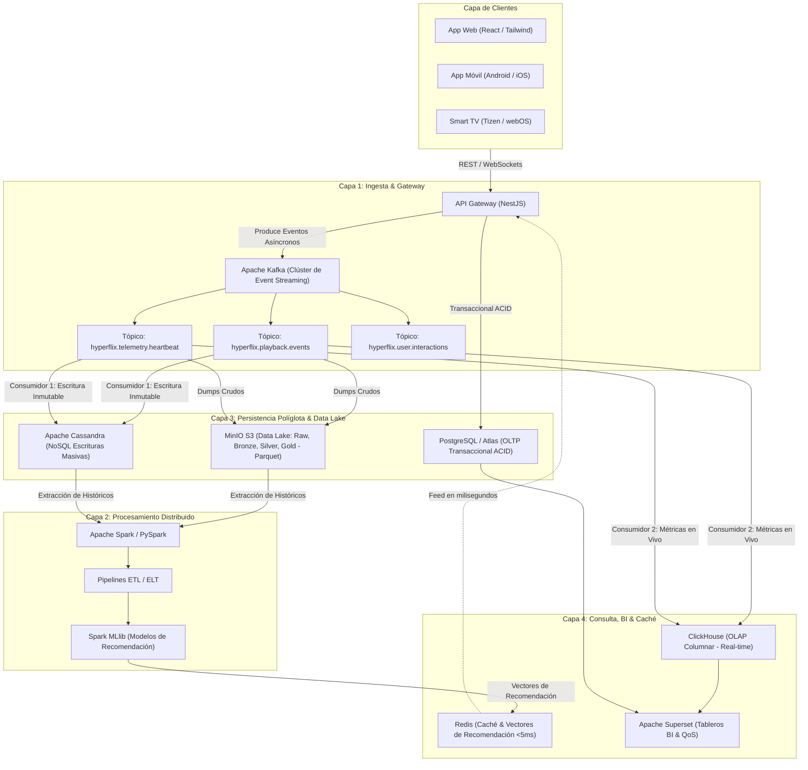
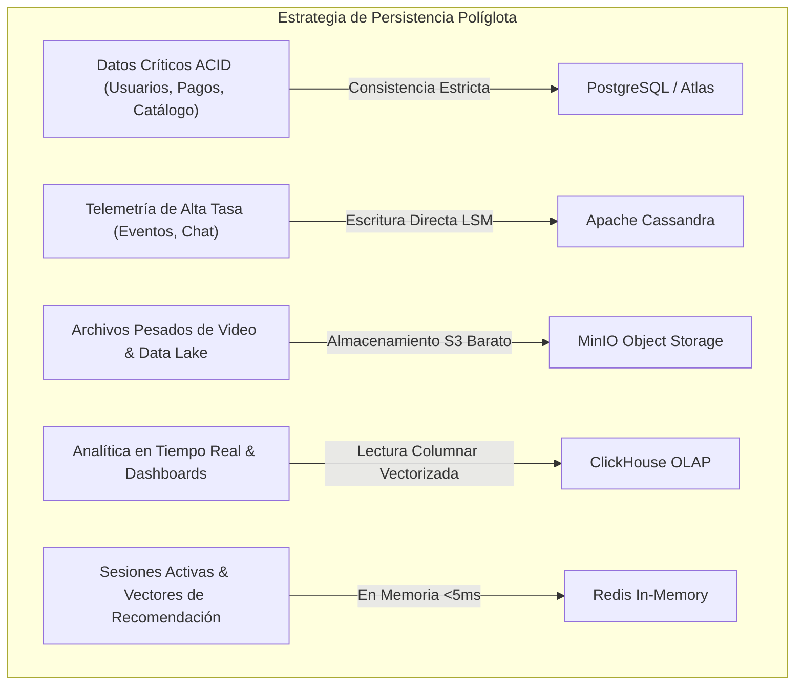
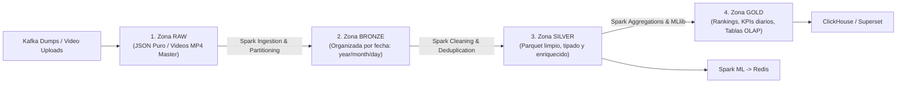
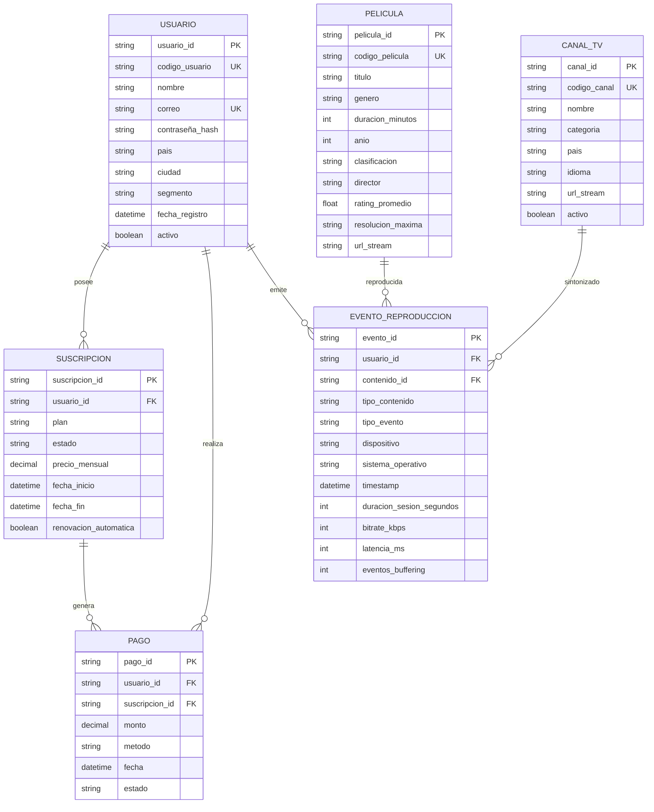
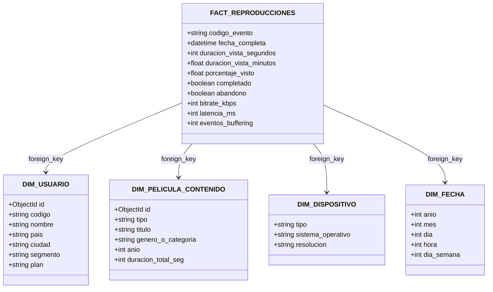

# HYPERFLIX — Documento Maestro de Arquitectura de Datos
**Materia:** Bases de Datos y Almacenamiento Masivo  
**Semestre:** 2026-1 (Octavo Semestre) — ITP  
**Fase 1:** Semanas 1 y 2 — Análisis de Requisitos y Diseño de Arquitectura  

---

## 1. Propuesta del Proyecto

**HYPERFLIX** es una plataforma de streaming ficticia orientada a eventos, diseñada bajo una arquitectura de persistencia políglota y microservicios. Aunque de cara al usuario final ofrece una experiencia premium de descubrimiento y reproducción de películas bajo demanda (VOD) y sintonización de canales de televisión públicos y libres (IPTV), el objetivo técnico primordial es **capturar, procesar, transformar y analizar la telemetría y el comportamiento de los usuarios a gran escala**.

A partir de este flujo continuo de eventos (reproducciones, pausas, saltos, abandonos, búsquedas e interacciones), la arquitectura alimenta un pipeline de procesamiento distribuido para entrenar modelos de **Machine Learning (Spark MLlib)** y generar recomendaciones personalizadas entregadas con latencias ultra-bajas mediante **Redis**.

### Características Fundamentales
- **Landing Page & Web Platform:** Interfaz web moderna para navegación del catálogo e información de la plataforma.
- **Canales IPTV Públicos y Libres:** Reproductor HLS integrado con listas de canales abiertos (noticias, cultura, deportes) procedentes de repositorios públicos como `iptv-org`.
- **Telemetría en Tiempo Real:** Emisión y desacoplamiento de eventos de usuario a través de Apache Kafka.
- **Data Lake Multizona:** Almacenamiento distribuido en MinIO particionado en 4 zonas: Raw, Bronze, Silver y Gold en formato Parquet.

---

## 2. Diagrama de Arquitectura Global del Sistema



---

## 3. SEMANA 1 — Análisis de Requisitos

### Paso 1 — Caracterización de la Empresa
| Pregunta | Respuesta Técnica |
|---|---|
| **¿Qué hace la empresa?** | HYPERFLIX ofrece streaming de video bajo demanda (películas) y transmisión de canales IPTV públicos en vivo. |
| **¿Cuántos usuarios tiene?** | **1.000.000 de usuarios registrados**, con crecimiento proyectado a 5.000.000. |
| **¿Qué tipos de datos genera?** | Usuarios, películas, canales TV, pagos, suscripciones, reproducciones, pausas, búsquedas, likes, tiempo de reproducción, errores de buffering, telemetría de red, dispositivos, sesiones y logs. |
| **¿Qué aplicaciones producen los datos?** | Aplicación Web (React), App móvil (iOS/Android), Smart TV App, API Backend (NestJS) y agentes de telemetría de reproductores de video. |
| **¿Cuáles son los datos críticos?** | Credenciales de usuario, pasarelas de pago, eventos de reproducción para algoritmos de recomendación y logs de estabilidad del servicio. |
| **¿Qué información necesita analizar?** | Películas más vistas, retención por país, tasa de abandono (*drop-off rate*), métricas de QoS (buffering/latencia) por tipo de dispositivo y picos de tráfico en horas punta. |

---

### Paso 2 — Clasificación de los Datos

| Tipo | Ejemplo | Velocidad | Uso Arquitectónico |
|---|---|---|---|
| **Sistema** | Configuración, catálogos, flags de despliegue | Baja | OLTP / Configuración |
| **Usuarios y perfiles** | Registro, perfil, país, segmento, estado de cuenta | Baja | OLTP (PostgreSQL / Atlas) |
| **Catálogo audiovisual** | Películas, géneros, categorías, actores, metadatos | Baja | OLTP / Consultas de Catálogo |
| **Reproducciones** | Inicio, pausa, reanudación, finalización de video | Alta | Streaming / Analítica (Kafka ➔ Cassandra) |
| **Búsquedas** | Término buscado, timestamp, usuario_id, clics | Alta | Streaming / Analítica |
| **Interacciones** | Likes, favoritos, calificaciones (1-5 estrellas) | Alta | Streaming / Analítica |
| **Dispositivos** | Smart TV, Móvil Android, iPhone, PC Web, SO | Media | OLTP / Analítica |
| **Sesiones** | Inicio de sesión, cierre, token JWT, duración | Alta | Streaming / Seguridad |
| **Errores y calidad (QoS)**| Buffering, pérdida de paquetes, latencia, bitrate | Alta | Streaming / Monitoreo en Vivo |
| **Eventos de comportamiento**| Play, pause, seek, abandono, vista completa | Muy alta | Streaming / Motor de Recomendación |
| **Suscripciones** | Plan (Básico, Estándar, Premium), fechas, renovación | Baja | OLTP Transaccional |
| **Seguridad** | Login, intentos fallidos, cambios de credenciales | Media-Alta | Seguridad / Auditoría |
| **Logs** | Errores de API, trazas de microservicios, Kafka logs | Muy alta | Monitoreo / Elasticsearch / ClickHouse |
| **Recomendaciones** | Películas sugeridas, score de afinidad, vectores | Media | ML (Spark) ➔ Redis |
| **Analítica** | Usuarios activos (DAU/MAU), top contenido, retención | Media | BI (ClickHouse / Superset) |
| **Histórico / Data Lake** | Archivos Parquet de eventos limpios y métricas | Alta | Batch / Spark / MinIO |
| **Canales TV en vivo** | Nombre, categoría, país, idioma, stream HLS | Media | OLTP / Streaming |
| **Fuentes de canales** | Repositorios M3U (iptv-org), APIs de TV abierta | Baja-Media | Integración / Administración |
| **Fuentes de películas** | MinIO S3 URL firmadas, resolución 4K/1080p | Baja-Media | Almacenamiento de Objetos |
| **Eventos de TV en vivo** | Cambio de canal (zapping), tiempo en señal, errores | Alta | Streaming / Analítica |

---

### Paso 3 — Cálculo de Volumen (Requisito > 100 GB)

Dando cumplimiento estricto al requerimiento de diseñar una arquitectura capaz de manejar al menos **100 GB**, para un clúster de **1.000.000 de usuarios registrados**:

1. **Estimación de Usuarios Diarios Activos (DAU):**  
   $$1.000.000 \text{ usuarios} \times 10\% = 100.000 \text{ usuarios activos/día}$$

2. **Generación de Eventos Diarios:**  
   Cada usuario activo genera en promedio 200 eventos por sesión (heartbeats cada 10 segundos, play, pause, seek, interacciones, cambios de volumen y bitrate):  
   $$100.000 \text{ usuarios} \times 200 \text{ eventos} = 20.000.000 \text{ eventos/día}$$

3. **Volumen de Telemetría de Streaming:**  
   A un tamaño promedio de **2 KB por payload JSON** enriquecido:  
   $$20.000.000 \text{ eventos} \times 2 \text{ KB} = 40.000.000 \text{ KB} \approx 40 \text{ GB diarios}$$

4. **Volumen Transaccional y Logs de Sistema:**  
   - Base de datos transaccional (altas, suscripciones, facturación): **2 GB/día**
   - Logs de API Gateway, microservicios, Kafka y Spark: **10 GB/día**

5. **Total Diario y Acumulado en 5 Días:**  
   $$\text{Total Diario} = 40 \text{ GB} + 2 \text{ GB} + 10 \text{ GB} = \mathbf{52 \text{ GB/día}}$$  
   $$\text{Volumen en 5 Días} = 52 \text{ GB/día} \times 5 \text{ días} = \mathbf{260 \text{ GB}}$$  
   *(Superando holgadamente la meta mínima de 100 GB para la justificación del parcial).*

---

### Paso 4 — Cálculo de Velocidad

- **Tasa Promedio Diaria:**  
  $$\text{Tasa Promedio} = \frac{20.000.000 \text{ eventos}}{86.400 \text{ segundos}} \approx \mathbf{231 \text{ eventos/segundo}}$$

- **Hora Pico (Estrenos o Prime-Time Nocturno 8:00 PM - 11:00 PM):**  
  Concentración del 50% de las reproducciones en 3 horas (10.800 s):  
  $$\text{Tasa Pico} = \frac{10.000.000 \text{ eventos}}{10.800 \text{ segundos}} \approx \mathbf{925 - 1.500 \text{ eventos/segundo}}$$

- **Tasa Máxima Esperada (Stress / Estreno Global de Blockbuster):**  
  Capacidad de amortiguamiento dimensionada en Kafka para:  
  $$\text{Capacidad Stress} = \mathbf{3.000 \text{ eventos/segundo}}$$

---

### Paso 5 — Variedad de los Datos

- **Estructurados:** Tablas relacionales con esquema rígido: Usuarios, Suscripciones, Catálogo maestro de Películas, Canales IPTV y Registro contable de Pagos (Almacenados en PostgreSQL / colecciones tipadas en MongoDB).
- **Semi-estructurados:** Cargas útiles en formato JSON de eventos de telemetría, métricas de buffering, logs distribuidos y metadatos de sincronización M3U (Ingestados por Kafka, almacenados en Cassandra y MinIO Raw).
- **No estructurados:** Archivos binarios pesados de video (fragmentos HLS `.ts` y manifiestos `.m3u8`), pósteres en alta resolución, capturas de miniaturas y audios multipista (Almacenados en MinIO S3).

---

## 4. SEMANA 2 — Diseño de Arquitectura

### Capa 1: Ingesta (Kafka & Gateway)
- **API Gateway (NestJS):** Recibe las peticiones HTTP y WebSockets de los clientes. Aplica autenticación JWT y rate limiting. En lugar de bloquear la base de datos con escrituras sincrónicas ante cada acción del reproductor, despacha inmediatamente un mensaje asíncrono hacia Apache Kafka.
- **Tópicos de Apache Kafka (Particionados por `user_id` para garantizar orden de sesión):**
  1. `hyperflix.playback.events`: Eventos explícitos (PLAY, PAUSE, SEEK, STOP, COMPLETE, ABANDON).
  2. `hyperflix.telemetry.heartbeat`: Telemetría continua cada 10 segundos por reproductor activo (bitrate, latencia, cuadros caídos).
  3. `hyperflix.user.interactions`: Búsquedas, calificaciones, likes, adición a lista y chat de estrenos.
  4. `hyperflix.iptv.events`: Métricas de consumo de TV en vivo y latencia de streams públicos.
  5. `hyperflix.system.logs`: Trazas y auditoría de microservicios.

---

### Capa 2: Procesamiento (Apache Spark & PySpark)
Motor de cómputo distribuido que procesa lotes históricos y flujos continuos:
- **Limpieza y Deduplicación:** Filtrado de eventos duplicados por fallas intermitentes de red en clientes móviles.
- **Enriquecimiento (Joins):** Cruce entre los identificadores de eventos de streaming y las dimensiones de usuarios, suscripciones y películas.
- **Cómputo de Hechos:** Cálculo de duración total vista, tasa de completitud, detección de abandono y métricas de calidad de red.
- **Spark MLlib (Filtrado Colaborativo ALS):** Algoritmo de mínimos cuadrados alternantes (*Alternating Least Squares*) para predecir afinidades y generar el vector de recomendaciones de cada usuario, escribiendo los resultados directamente en Redis.

---

### Capa 3: Almacenamiento (Persistencia Políglota)

#### Justificación de Motores según la Regla Fundamental



1. **PostgreSQL / Atlas (OLTP Relacional):**
   - **¿Qué problema resuelve?** Garantiza integridad transaccional estricta (ACID) para facturación, suscripciones y datos de cuentas de usuario.
   - **¿Por qué se eligió?** Soporta transacciones atómicas y restricciones de clave foránea indispensables para la lógica de cobro y membresías.
   - **Ventaja:** Cero riesgo de inconsistencias contables o estados de suscripción corruptos.
   - **Compromiso:** No escala horizontalmente para soportar miles de escrituras de telemetría por segundo.

2. **Apache Cassandra (NoSQL Wide-Column):**
   - **¿Qué problema resuelve?** Absorbe ráfagas de más de 3.000 escrituras concurrentes por segundo sin bloquear el sistema transaccional.
   - **¿Por qué se eligió?** Su arquitectura *masterless* y almacenamiento basado en LSM-Trees escribe directamente en memoria (*Memtable*) y disco (*SSTable*) con latencia mínima.
   - **Ventaja:** Escalabilidad lineal horizontal sin punto único de falla.
   - **Compromiso:** Requiere modelado estrictamente orientado a las consultas (*query-driven*), sin posibilidad de sentencias JOIN.

3. **MinIO (Data Lake S3-Compatible & Object Storage):**
   - **¿Qué problema resuelve?** Preserva toda la historia de telemetría original sin pérdidas y hospeda los terabytes de fragmentos de video HLS `.ts`.
   - **¿Por qué se eligió?** Código abierto, altamente distribuido y 100% compatible con la API de AWS S3.
   - **Ventaja:** Desacopla completamente almacenamiento de cómputo a un costo ínfimo por gigabyte.
   - **Compromiso:** Inmutable; no admite modificaciones puntuales de registros ni consultas analíticas directas de baja latencia.

4. **Formato Apache Parquet (Snappy):**
   - **¿Qué problema resuelve?** Reduce entre 60% y 80% el espacio en disco frente a JSON/CSV y acelera las consultas de Spark hasta 10x gracias a *column projection* (leer solo las columnas necesarias) y *predicate pushdown* (omitir bloques de datos mediante metadatos min/max).

---

### Paso 7 — Zonas del Data Lake



1. **Zona RAW:** Repositorio de aterrizaje inmutable. Contiene los JSON crudos provenientes de Kafka y los archivos de video originales subidos por proveedores:
   `data-lake/raw/telemetria_video/year=2026/month=09/day=02/eventos_raw.json`
2. **Zona BRONZE:** Datos estructurados y particionados por origen y fecha, preservando la fidelidad del dato original.
3. **Zona SILVER:** Datos depurados, deduplicados, tipados y cruzados con las dimensiones de usuarios y películas. Esta es la fuente que consume el motor de recomendaciones.
4. **Zona GOLD:** Vistas analíticas agregadas (Top 10 películas diarias, tasa de abandono por país, tiempos de buffering por dispositivo), listas para ser consumidas por ClickHouse y Superset.

---

### Paso 10 — Modelo de Datos OLTP



---

### Paso 11 — Modelo Dimensional OLAP (Modelo en Estrella)

Para la capa analítica en ClickHouse / MongoDB OLAP, los datos se organizan en un **Modelo en Estrella**:



---

## 4.4. Estrategia de Resiliencia y Disaster Recovery Cross-Region (DR)

Para proteger la infraestructura frente a cortes totales de centros de datos, incidentes de red transcontinentales o catástrofes regionales en la nube, HYPERFLIX implementa una arquitectura **Multi-Región Cross-Region** bajo el modelo **Warm Standby**:

### 1. Parámetros de Recuperación (RPO y RTO)
- **RPO (Recovery Point Objective):** $< 1$ minuto para transacciones críticas y cuentas de usuarios; $< 5$ minutos para telemetría de streaming (amortiguada por el búfer local en reproductores cliente).
- **RTO (Recovery Time Objective):** $< 5$ minutos para conmutación por error (*automatic failover*) en la base de datos y API Gateway; $< 15$ minutos para despliegue de cómputo analítico Big Data.

### 2. Topología Geográfica Desacoplada
- **Región Primaria (Activa):** AWS `us-east-1` (Norte de Virginia) — 100% de operaciones en producción.
- **Región Secundaria (DR / Warm Standby):** AWS `us-west-2` (Oregón) — Réplica continua y capacidad en reserva.

### 3. Mecanismos por Capa
- **Base de Datos (MongoDB Atlas):** Clúster Multi-Región con réplica continua del Oplog entre regiones, conmutación automática por consenso Raft y Point-in-Time Recovery (PITR) con ventana de 7 días.
- **Data Lake (S3 Parquet):** Cross-Region Replication (CRR) asíncrona para todas las particiones (`raw/`, `processed/`, `curated/`) con bloqueo de inmutabilidad (Object Lock WORM).
- **Ingesta y Streaming:** Apache Kafka MirrorMaker 2 (MM2) para sincronización de tópicos y offsets de telemetría.
- **Enrutamiento Global:** AWS Route 53 / Cloudflare DNS Failover con Health Checks activos cada 10s (TTL: 60s).

> 📘 **Especificación detallada:** Para consultar el runbook de failover paso a paso, los diagramas de flujo y el plan de simulacros semestrales, ver el documento maestro: [docs/DISASTER_RECOVERY_CROSS_REGION.md](DISASTER_RECOVERY_CROSS_REGION.md).

---

## 5. Implementación y Validación Práctica en el Repositorio

El repositorio cuenta con la implementación ejecutable completa que valida esta arquitectura:

| Componente | Archivo | Responsabilidad Técnica |
|---|---|---|
| **Conexión Central** | `conexion.py` | Conexión segura a MongoDB Atlas (`hyperflix_db`) con soporte UTF-8 para Windows. |
| **Inicializador de Esquemas** | `scripts/crear_estructura.py` | Crea colecciones OLTP, índices de unicidad/búsqueda, datos semilla y colección OLAP. |
| **Generador Masivo** | `scripts/generar_datos_masivos.py` | Simula 1.500+ usuarios, 60+ películas, canales IPTV y más de 20.000 eventos de telemetría de streaming. |
| **Pipeline ETL / ELT** | `scripts/transformar_oltp_a_olap.py` | Pipeline de agregación que construye el Modelo en Estrella (`reproducciones_analiticas`). |
| **Data Lake Parquet (Fase 2)** | `data_lake.py` | Pipeline oficial de Data Lake (Atlas ➔ Pandas ➔ Parquet Snappy en zonas `raw`, `processed`, `curated`). |
| **Consumidor CDC (Spark Streaming)** | `scripts/consumidor_streaming_cdc.py` | Consumidor reactivo con Change Streams que procesa, enriquece y detecta anomalías QoS en tiempo real. |
| **Productor Streaming (Kafka)** | `scripts/productor_streaming.py` | Emisor continuo de telemetría de streaming y eventos de usuario hacia MongoDB Atlas. |
| **Infraestructura como Código (IaC)** | `terraform/` + `infraestructura.py` | Definición declarativa de clúster Atlas Multi-Región y S3 Data Lake CRR con script de automatización. |
| **Plataforma Web & IPTV** | `web/index.html` + `web/app.js` | Landing page, catálogo interactivo, reproductor IPTV en vivo vía HLS y monitor de telemetría. |

---

## 6. Guía de Ejecución Rápida

1. **Instalar dependencias:**
   ```bash
   pip install -r requirements.txt
   ```
2. **Probar conexión:**
   ```bash
   python conexion.py
   ```
3. **Crear estructura e índices:**
   ```bash
   python scripts/crear_estructura.py
   ```
4. **Generar volumen masivo de datos:**
   ```bash
   python scripts/generar_datos_masivos.py
   ```
5. **Ejecutar transformación OLTP a OLAP:**
   ```bash
   python scripts/transformar_oltp_a_olap.py
   ```
6. **Ejecutar Benchmarking de Consultas Analíticas:**
   ```bash
   python scripts/benchmarking_consultas.py
   ```
7. **Ejecutar Pipeline del Data Lake (Parquet Snappy):**
   ```bash
   python data_lake.py
   ```
8. **Demostración de Event Streaming y CDC en Tiempo Real (2 Terminales):**
   - **Terminal 1 (Consumidor Spark Streaming / Change Streams):**
     ```bash
     python scripts/consumidor_streaming_cdc.py
     ```
   - **Terminal 2 (Productor de Telemetría / Apache Kafka):**
     ```bash
     python scripts/productor_streaming.py
     ```
9. **Lanzar la Plataforma Web & Visor IPTV:**
   Abrir el archivo `web/index.html` directamente en el navegador o iniciar un servidor local:
   ```bash
   python -m http.server 8000 --directory web
   ```
