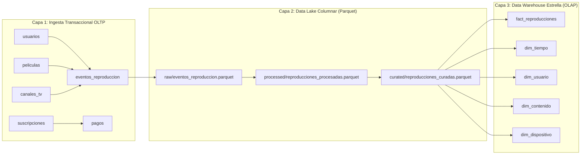

# 📖 HYPERFLIX — Catálogo y Diccionario Oficial de Datos
**Materia:** Bases de Datos y Almacenamiento Masivo (Octavo Semestre)  
**Programa:** Ingeniería de Sistemas — Instituto Tecnológico del Putumayo (ITP)  
**Generación Automática:** 2026-09-22 20:00:45  
**Dominio:** Plataforma de Streaming de Video, VOD, Canales IPTV y Telemetría QoS  

---

## 📌 1. ¿Qué es y Para Qué Sirve este Catálogo de Datos?
Un **Catálogo y Diccionario de Datos** es la fuente única de verdad (*Single Source of Truth*) que describe detalladamente todos los activos de información almacenados en la plataforma **HYPERFLIX**.
Cumple funciones críticas de ingeniería y negocio:
1. **Gobernanza de Datos:** Clasifica cada campo según su nivel de privacidad y sensibilidad (Pública, Interna, Confidencial PII bajo Habeas Data / GDPR).
2. **Descubrimiento y Autoservicio (Self-Service Analytics):** Permite a desarrolladores, analistas de Power BI y científicos de datos comprender de inmediato el significado técnico de cada métrica (ej. `bitrate_kbps`, `porcentaje_completitud`).
3. **Trazabilidad y Linaje de Datos:** Mapea cómo fluye la información desde la captura transaccional (**OLTP**) pasando por el **Data Lake Parquet (Raw ➔ Processed ➔ Curated)** hasta el **Modelo Dimensional en Estrella (OLAP)**.
4. **Auditoría Automatizada:** Generado programáticamente mediante introspección directa de esquemas para evitar la desincronización de documentación manual.

---

## 📊 2. Resumen General del Ecosistema de Datos

| Métrica del Sistema | Valor Detectado en Vivo | Observación Técnica |
|---|:---:|---|
| **Colecciones Activas en Atlas** | **12** | Capas OLTP, OLAP y Modelo Dimensional en Estrella |
| **Volumen de Documentos en Atlas** | **65,265** | Registros analíticos y transaccionales vivos |
| **Particiones Parquet en Data Lake** | **9** | Archivos columnars con compresión Snappy |
| **Zonas del Data Lake Cubiertas** | **3 (Raw, Processed, Curated)** | Arquitectura estándar Medallion Lakehouse |

---

## 🔄 3. Diagrama de Linaje de Datos (Data Lineage)

---

## 🗄️ 4. Diccionario de Datos — MongoDB Atlas (`hyperflix_db`)

### 📦 Colección: `canales_tv`
- **Capa de Arquitectura:** Transaccional / Ingesta (OLTP)
- **Total de Documentos:** 13
- **Total de Campos:** 11
- **Estrategia de Indexación:** `_id_` (Simple: _id), `idx_codigo_canal` (Único: codigo_canal), `idx_canal_categoria_pais` (Compuesto: categoria, pais)

| Campo / Atributo | Tipo BSON | Restricción | Sensibilidad | Descripción de Negocio | Ejemplo |
|---|---|:---:|:---:|---|---|
| `_id` | ObjectId (BSON Key) | Clave Primaria | `Interna` | Identificador único autogenerado del documento BSON. | `6aa1aac2d59c70dc61ee2cb5` |
| `codigo_canal` | String (Varchar) | Único / Indexado | `Pública` | Identificador único del canal de televisión en vivo (IPTV-XXX). | `IPTV-001` |
| `nombre` | String (Varchar) | Requerido | `Confidencial (PII)` | Nombre completo o alias del suscriptor de la plataforma. | `France 24 Español` |
| `categoria` | String (Varchar) | Indexado | `Pública` | Categoría temática de la señal: Noticias, Deportes, Cultura, Música, General. | `Noticias` |
| `pais` | String (Varchar) | Indexado | `Interna` | País de residencia del usuario para segmentación geográfica de catálogo. | `Francia / Internacional` |
| `idioma` | String (Varchar) | Informativo | `Pública` | Idioma principal de la transmisión en vivo. | `Español` |
| `url_stream` | String (Varchar) | General | `Interna` | Campo operacional de la entidad canales_tv. | `https://raw.githubusercontent.com/iptv-org/iptv...` |
| `stream_hls_directo` | String (Varchar) | General | `Interna` | Campo operacional de la entidad canales_tv. | `https://f24hls-i.akamaihd.net/hls/live/221193/F...` |
| `logo_url` | String (Varchar) | General | `Interna` | Campo operacional de la entidad canales_tv. | `https://upload.wikimedia.org/wikipedia/commons/...` |
| `activo` | Boolean | Booleano | `Interna` | Flag booleano que indica si la señal se encuentra al aire. | `True` |
| `tipo` | String (Varchar) | General | `Interna` | Campo operacional de la entidad canales_tv. | `IPTV Público Libre` |

---

### 📦 Colección: `dim_contenido`
- **Capa de Arquitectura:** Data Warehouse - Dimensión (OLAP)
- **Total de Documentos:** 79
- **Total de Campos:** 10
- **Estrategia de Indexación:** `_id_` (Simple: _id)

| Campo / Atributo | Tipo BSON | Restricción | Sensibilidad | Descripción de Negocio | Ejemplo |
|---|---|:---:|:---:|---|---|
| `_id` | ObjectId (BSON Key) | Clave Primaria | `Interna` | Identificador único autogenerado del documento BSON. | `6aa1ab165037070afee35a2c` |
| `titulo` | String (Varchar) | Requerido | `Pública` | Nombre comercial de la película o contenido bajo demanda. | `El Laberinto Eterno` |
| `tipo_contenido` | String (Varchar) | Indexado | `Interna` | Tipo de transmisión: PELICULA_VOD o CANAL_TV_IPTV. | `Pelicula` |
| `genero_o_categoria` | String (Varchar) | General | `Interna` | Campo operacional de la entidad dim_contenido. | `Comedia` |
| `anio_estreno` | Integer (Int32 / Int64) | General | `Interna` | Campo operacional de la entidad dim_contenido. | `2015` |
| `total_reproducciones` | Integer (Int32 / Int64) | General | `Interna` | Campo operacional de la entidad dim_contenido. | `250` |
| `contenido_id` | ObjectId (BSON Key) | Clave Foránea | `Interna` | Identificador del contenido audiovisual sintonizado. | `6aa1ab165037070afee35a2c` |
| `minutos_totales` | Double / Float | General | `Interna` | Campo operacional de la entidad dim_contenido. | `24214.7` |
| `porcentaje_completitud_promedio` | Double / Float | General | `Interna` | Campo operacional de la entidad dim_contenido. | `60.9` |
| `bitrate_promedio_kbps` | Double / Float | General | `Interna` | Campo operacional de la entidad dim_contenido. | `9745.0` |

---

### 📦 Colección: `dim_dispositivo`
- **Capa de Arquitectura:** Data Warehouse - Dimensión (OLAP)
- **Total de Documentos:** 9
- **Total de Campos:** 7
- **Estrategia de Indexación:** `_id_` (Simple: _id)

| Campo / Atributo | Tipo BSON | Restricción | Sensibilidad | Descripción de Negocio | Ejemplo |
|---|---|:---:|:---:|---|---|
| `_id` | String (Varchar) | Clave Primaria | `Interna` | Identificador único autogenerado del documento BSON. | `PC Web Safari` |
| `sistema_operativo` | String (Varchar) | General | `Interna` | Campo operacional de la entidad dim_dispositivo. | `macOS Sonoma` |
| `resolucion_max` | String (Varchar) | General | `Interna` | Campo operacional de la entidad dim_dispositivo. | `2560x1440 (2K)` |
| `total_sesiones` | Integer (Int32 / Int64) | Métrica Acumulada | `Interna` | Conteo agregado de sesiones de streaming en la ventana temporal. | `2881` |
| `tipo_dispositivo` | String (Varchar) | General | `Interna` | Campo operacional de la entidad dim_dispositivo. | `PC Web Safari` |
| `latencia_promedio_ms` | Double / Float | General | `Interna` | Campo operacional de la entidad dim_dispositivo. | `65.9` |
| `bitrate_promedio_kbps` | Double / Float | General | `Interna` | Campo operacional de la entidad dim_dispositivo. | `9916.0` |

---

### 📦 Colección: `dim_tiempo`
- **Capa de Arquitectura:** Data Warehouse - Dimensión (OLAP)
- **Total de Documentos:** 425
- **Total de Campos:** 10
- **Estrategia de Indexación:** `_id_` (Simple: _id)

| Campo / Atributo | Tipo BSON | Restricción | Sensibilidad | Descripción de Negocio | Ejemplo |
|---|---|:---:|:---:|---|---|
| `_id` | Timestamp (ISO 8601) | Clave Primaria | `Interna` | Identificador único autogenerado del documento BSON. | `2026-09-09 13:48:32` |
| `fecha` | Timestamp (ISO 8601) | General | `Interna` | Campo operacional de la entidad dim_tiempo. | `2026-09-09 13:48:32` |
| `anio` | Integer (Int32 / Int64) | General | `Interna` | Campo operacional de la entidad dim_tiempo. | `2026` |
| `mes` | Integer (Int32 / Int64) | General | `Interna` | Campo operacional de la entidad dim_tiempo. | `9` |
| `dia` | Integer (Int32 / Int64) | General | `Interna` | Campo operacional de la entidad dim_tiempo. | `9` |
| `hora` | Integer (Int32 / Int64) | General | `Interna` | Campo operacional de la entidad dim_tiempo. | `13` |
| `dia_semana` | Integer (Int32 / Int64) | General | `Interna` | Campo operacional de la entidad dim_tiempo. | `4` |
| `trimestre` | Double / Float | Atributo Dimensión | `Interna` | Trimestre del año (Q1, Q2, Q3, Q4) calculado con $ceil y $divide. | `3.0` |
| `es_fin_de_semana` | String (Varchar) | General | `Interna` | Campo operacional de la entidad dim_tiempo. | `No` |
| `es_hora_pico` | String (Varchar) | General | `Interna` | Campo operacional de la entidad dim_tiempo. | `No` |

---

### 📦 Colección: `dim_usuario`
- **Capa de Arquitectura:** Data Warehouse - Dimensión (OLAP)
- **Total de Documentos:** 1,503
- **Total de Campos:** 12
- **Estrategia de Indexación:** `_id_` (Simple: _id)

| Campo / Atributo | Tipo BSON | Restricción | Sensibilidad | Descripción de Negocio | Ejemplo |
|---|---|:---:|:---:|---|---|
| `_id` | ObjectId (BSON Key) | Clave Primaria | `Interna` | Identificador único autogenerado del documento BSON. | `6aa1ab175037070afee35c73` |
| `codigo_usuario` | String (Varchar) | Único / Indexado | `Interna` | Código único de negocio asignado al suscriptor (USR-XXXXX). | `USR-10571` |
| `nombre` | String (Varchar) | Requerido | `Confidencial (PII)` | Nombre completo o alias del suscriptor de la plataforma. | `Dorotea Armengol Sebastián` |
| `pais` | String (Varchar) | Indexado | `Interna` | País de residencia del usuario para segmentación geográfica de catálogo. | `Colombia` |
| `ciudad` | String (Varchar) | Opcional | `Interna` | Ciudad o municipio de residencia del suscriptor. | `Bogotá` |
| `plan_suscripcion` | String (Varchar) | General | `Interna` | Campo operacional de la entidad dim_usuario. | `Estándar HD` |
| `segmento` | String (Varchar) | Indexado | `Interna` | Segmentación comercial del usuario: VIP, ESTUDIANTE, FREEMIUM, REGULAR. | `Fin de Semana` |
| `total_sesiones` | Integer (Int32 / Int64) | Métrica Acumulada | `Interna` | Conteo agregado de sesiones de streaming en la ventana temporal. | `13` |
| `usuario_id` | ObjectId (BSON Key) | Clave Foránea | `Interna` | Referencia al suscriptor titular de la cuenta. | `6aa1ab175037070afee35c73` |
| `total_minutos_vistos` | Double / Float | General | `Interna` | Campo operacional de la entidad dim_usuario. | `977.0` |
| `promedio_minutos_sesion` | Double / Float | General | `Interna` | Campo operacional de la entidad dim_usuario. | `75.2` |
| `latencia_promedio_ms` | Double / Float | General | `Interna` | Campo operacional de la entidad dim_usuario. | `87.5` |

---

### 📦 Colección: `eventos_reproduccion`
- **Capa de Arquitectura:** Transaccional / Ingesta (OLTP)
- **Total de Documentos:** 20,008
- **Total de Campos:** 18
- **Estrategia de Indexación:** `_id_` (Simple: _id), `idx_eventos_usr_time` (Compuesto: usuario_id, timestamp), `idx_eventos_content_type` (Compuesto: contenido_id, tipo_evento), `idx_eventos_timestamp` (Simple: timestamp)

| Campo / Atributo | Tipo BSON | Restricción | Sensibilidad | Descripción de Negocio | Ejemplo |
|---|---|:---:|:---:|---|---|
| `_id` | ObjectId (BSON Key) | Clave Primaria | `Interna` | Identificador único autogenerado del documento BSON. | `6aa1aac3d59c70dc61ee2cc3` |
| `codigo_evento` | String (Varchar) | Único / Indexado | `Interna` | Identificador único del evento de streaming emitido (EVT-XXXXX). | `EVT-0001` |
| `usuario_id` | ObjectId (BSON Key) | Clave Foránea | `Interna` | Referencia al suscriptor titular de la cuenta. | `6aa1aac2d59c70dc61ee2cba` |
| `contenido_id` | ObjectId (BSON Key) | Clave Foránea | `Interna` | Identificador del contenido audiovisual sintonizado. | `6aa1aac2d59c70dc61ee2caf` |
| `tipo_contenido` | String (Varchar) | Indexado | `Interna` | Tipo de transmisión: PELICULA_VOD o CANAL_TV_IPTV. | `Pelicula` |
| `tipo_evento` | String (Varchar) | General | `Interna` | Campo operacional de la entidad eventos_reproduccion. | `PLAY` |
| `dispositivo` | String (Varchar) | Objeto | `Interna` | Subdocumento con metadatos del reproductor: tipo, SO, navegador, app_version. | `Smart TV Samsung` |
| `sistema_operativo` | String (Varchar) | General | `Interna` | Campo operacional de la entidad eventos_reproduccion. | `Tizen` |
| `timestamp` | Timestamp (ISO 8601) | General | `Interna` | Campo operacional de la entidad eventos_reproduccion. | `2026-09-09 10:51:47.656000` |
| `segundo_reproduccion` | Integer (Int32 / Int64) | General | `Interna` | Campo operacional de la entidad eventos_reproduccion. | `0` |
| `duracion_sesion_segundos` | Integer (Int32 / Int64) | General | `Interna` | Campo operacional de la entidad eventos_reproduccion. | `0` |
| `bitrate_kbps` | Integer (Int32 / Int64) | General | `Interna` | Campo operacional de la entidad eventos_reproduccion. | `15000` |
| `latencia_ms` | Integer (Int32 / Int64) | General | `Interna` | Campo operacional de la entidad eventos_reproduccion. | `42` |
| `resolucion` | String (Varchar) | General | `Interna` | Campo operacional de la entidad eventos_reproduccion. | `3840x2160 (4K)` |
| `duracion_total_contenido_segundos` | Integer (Int32 / Int64) | General | `Interna` | Campo operacional de la entidad eventos_reproduccion. | `4171` |
| `completado` | Boolean | General | `Interna` | Campo operacional de la entidad eventos_reproduccion. | `True` |
| `abandono` | Boolean | General | `Interna` | Campo operacional de la entidad eventos_reproduccion. | `False` |
| `eventos_buffering` | Integer (Int32 / Int64) | General | `Interna` | Campo operacional de la entidad eventos_reproduccion. | `0` |

---

### 📦 Colección: `fact_reproducciones`
- **Capa de Arquitectura:** Data Warehouse - Tabla de Hechos (OLAP)
- **Total de Documentos:** 20,008
- **Total de Campos:** 12
- **Estrategia de Indexación:** `_id_` (Simple: _id)

| Campo / Atributo | Tipo BSON | Restricción | Sensibilidad | Descripción de Negocio | Ejemplo |
|---|---|:---:|:---:|---|---|
| `_id` | ObjectId (BSON Key) | Clave Primaria | `Interna` | Identificador único autogenerado del documento BSON. | `6aa1abca0bc1b824f102857d` |
| `codigo_evento` | String (Varchar) | Único / Indexado | `Interna` | Identificador único del evento de streaming emitido (EVT-XXXXX). | `EVT-0001` |
| `fecha_id` | Timestamp (ISO 8601) | Clave Primaria Dimensión | `Interna` | Clave subrogada de fecha en formato YYYYMMDD. | `2026-09-09 10:51:47.656000` |
| `usuario_id` | ObjectId (BSON Key) | Clave Foránea | `Interna` | Referencia al suscriptor titular de la cuenta. | `6aa1aac2d59c70dc61ee2cba` |
| `contenido_id` | ObjectId (BSON Key) | Clave Foránea | `Interna` | Identificador del contenido audiovisual sintonizado. | `6aa1aac2d59c70dc61ee2caf` |
| `dispositivo_tipo` | String (Varchar) | General | `Interna` | Campo operacional de la entidad fact_reproducciones. | `Smart TV Samsung` |
| `tipo_evento` | String (Varchar) | General | `Interna` | Campo operacional de la entidad fact_reproducciones. | `PLAY` |
| `duracion_segundos` | Integer (Int32 / Int64) | Técnico | `Interna` | Duración total de la película calculada en segundos para telemetría. | `0` |
| `duracion_minutos` | Double / Float | Requerido | `Pública` | Extensión total de la película expresada en minutos. | `0.0` |
| `porcentaje_visto` | Double / Float | General | `Interna` | Campo operacional de la entidad fact_reproducciones. | `0.0` |
| `bitrate_kbps` | Integer (Int32 / Int64) | General | `Interna` | Campo operacional de la entidad fact_reproducciones. | `15000` |
| `latencia_ms` | Integer (Int32 / Int64) | General | `Interna` | Campo operacional de la entidad fact_reproducciones. | `42` |

---

### 📦 Colección: `pagos`
- **Capa de Arquitectura:** Transaccional / Ingesta (OLTP)
- **Total de Documentos:** 137
- **Total de Campos:** 8
- **Estrategia de Indexación:** `_id_` (Simple: _id), `idx_pago_usuario_fecha` (Compuesto: usuario_id, fecha)

| Campo / Atributo | Tipo BSON | Restricción | Sensibilidad | Descripción de Negocio | Ejemplo |
|---|---|:---:|:---:|---|---|
| `_id` | ObjectId (BSON Key) | Clave Primaria | `Interna` | Identificador único autogenerado del documento BSON. | `6aa1aac3d59c70dc61ee2cc0` |
| `codigo_pago` | String (Varchar) | Único / Indexado | `Confidencial` | Código único de la transacción en la pasarela de pagos (PAY-XXXXX). | `PAY-2026-0001` |
| `usuario_id` | ObjectId (BSON Key) | Clave Foránea | `Interna` | Referencia al suscriptor titular de la cuenta. | `6aa1aac2d59c70dc61ee2cba` |
| `suscripcion_id` | ObjectId (BSON Key) | Clave Foránea | `Interna` | Referencia al contrato de suscripción asociado. | `6aa1aac3d59c70dc61ee2cbd` |
| `monto` | Integer (Int32 / Int64) | General | `Interna` | Campo operacional de la entidad pagos. | `45000` |
| `metodo` | String (Varchar) | General | `Interna` | Campo operacional de la entidad pagos. | `Tarjeta de Crédito` |
| `fecha` | Timestamp (ISO 8601) | General | `Interna` | Campo operacional de la entidad pagos. | `2026-08-10 13:51:47.050000` |
| `estado` | String (Varchar) | Indexado | `Interna` | Estado de la membresía: ACTIVA, CANCELADA, EN_MORA, PAUSADA. | `Completado` |

---

### 📦 Colección: `peliculas`
- **Capa de Arquitectura:** Transaccional / Ingesta (OLTP)
- **Total de Documentos:** 66
- **Total de Campos:** 13
- **Estrategia de Indexación:** `_id_` (Simple: _id), `idx_codigo_pelicula` (Único: codigo_pelicula), `idx_pelicula_genero_anio` (Compuesto: genero, anio)

| Campo / Atributo | Tipo BSON | Restricción | Sensibilidad | Descripción de Negocio | Ejemplo |
|---|---|:---:|:---:|---|---|
| `_id` | ObjectId (BSON Key) | Clave Primaria | `Interna` | Identificador único autogenerado del documento BSON. | `6aa1aac2d59c70dc61ee2caf` |
| `codigo_pelicula` | String (Varchar) | Único / Indexado | `Pública` | Código único del título audiovisual en el catálogo VOD (MOV-XXXXX). | `MOV-001` |
| `titulo` | String (Varchar) | Requerido | `Pública` | Nombre comercial de la película o contenido bajo demanda. | `Inception` |
| `genero` | String (Varchar) | Indexado | `Pública` | Género cinematográfico principal (Acción, Ciencia Ficción, Drama, Terror, etc.). | `Ciencia Ficción` |
| `duracion_minutos` | Integer (Int32 / Int64) | Requerido | `Pública` | Extensión total de la película expresada en minutos. | `148` |
| `anio` | Integer (Int32 / Int64) | General | `Interna` | Campo operacional de la entidad peliculas. | `2010` |
| `clasificacion` | String (Varchar) | General | `Interna` | Campo operacional de la entidad peliculas. | `PG-13` |
| `director` | String (Varchar) | General | `Interna` | Campo operacional de la entidad peliculas. | `Christopher Nolan` |
| `rating_promedio` | Double / Float | General | `Interna` | Campo operacional de la entidad peliculas. | `8.8` |
| `resolucion_maxima` | String (Varchar) | Técnico | `Pública` | Máxima calidad disponible en catálogo (4K UHD, 1080p FHD, 720p HD). | `4K` |
| `url_stream` | String (Varchar) | General | `Interna` | Campo operacional de la entidad peliculas. | `https://storage.hyperflix.io/vod/inception/mast...` |
| `url_portada` | String (Varchar) | General | `Interna` | Campo operacional de la entidad peliculas. | `https://images.unsplash.com/photo-1536440136628...` |
| `fecha_creacion` | Timestamp (ISO 8601) | General | `Interna` | Campo operacional de la entidad peliculas. | `2026-09-09 13:51:46.657000` |

---

### 📦 Colección: `reproducciones_analiticas`
- **Capa de Arquitectura:** Data Warehouse - Tabla de Hechos (OLAP)
- **Total de Documentos:** 20,008
- **Total de Campos:** 33
- **Estrategia de Indexación:** `_id_` (Simple: _id), `idx_tiempo` (Compuesto: anio, mes, dia), `idx_contenido_tipo_genero` (Compuesto: contenido.tipo, contenido.genero_o_categoria), `idx_usuario_pais_plan` (Compuesto: usuario.pais, usuario.plan), `idx_disp_buffering` (Compuesto: dispositivo.tipo, eventos_buffering), `idx_abandono_genero` (Compuesto: abandono, contenido.genero_o_categoria), `idx_hora_dia` (Compuesto: hora, dia_semana), `idx_segmento_ciudad` (Compuesto: usuario.segmento, usuario.ciudad), `idx_plan_duracion` (Compuesto: usuario.plan, duracion_vista_minutos), `idx_dia_duracion` (Compuesto: dia_semana, duracion_vista_minutos), `idx_disp_abandono` (Compuesto: dispositivo.tipo, abandono), `idx_usuario_duracion` (Compuesto: usuario.id, duracion_vista_minutos), `idx_mes_anio` (Compuesto: mes, anio), `idx_completado_duracion` (Compuesto: completado, duracion_vista_minutos)

| Campo / Atributo | Tipo BSON | Restricción | Sensibilidad | Descripción de Negocio | Ejemplo |
|---|---|:---:|:---:|---|---|
| `_id` | ObjectId (BSON Key) | Clave Primaria | `Interna` | Identificador único autogenerado del documento BSON. | `6aa1abca0bc1b824f102857d` |
| `dispositivo.tipo` | String (Varchar) | Dimensión | `Interna` | Tipo de pantalla receptora: SMART_TV, SMARTPHONE, LAPTOP, TABLET. | `Smart TV Samsung` |
| `dispositivo.sistema_operativo` | String (Varchar) | General | `Interna` | Campo operacional de la entidad reproducciones_analiticas. | `Tizen` |
| `dispositivo.resolucion` | String (Varchar) | General | `Interna` | Campo operacional de la entidad reproducciones_analiticas. | `3840x2160 (4K)` |
| `codigo_evento` | String (Varchar) | Único / Indexado | `Interna` | Identificador único del evento de streaming emitido (EVT-XXXXX). | `EVT-0001` |
| `fecha_completa` | Timestamp (ISO 8601) | General | `Interna` | Campo operacional de la entidad reproducciones_analiticas. | `2026-09-09 10:51:47.656000` |
| `anio` | Integer (Int32 / Int64) | General | `Interna` | Campo operacional de la entidad reproducciones_analiticas. | `2026` |
| `mes` | Integer (Int32 / Int64) | General | `Interna` | Campo operacional de la entidad reproducciones_analiticas. | `9` |
| `dia` | Integer (Int32 / Int64) | General | `Interna` | Campo operacional de la entidad reproducciones_analiticas. | `9` |
| `hora` | Integer (Int32 / Int64) | General | `Interna` | Campo operacional de la entidad reproducciones_analiticas. | `10` |
| `dia_semana` | Integer (Int32 / Int64) | General | `Interna` | Campo operacional de la entidad reproducciones_analiticas. | `4` |
| `usuario.id` | ObjectId (BSON Key) | General | `Interna` | Campo operacional de la entidad reproducciones_analiticas. | `6aa1aac2d59c70dc61ee2cba` |
| `usuario.codigo` | String (Varchar) | General | `Interna` | Campo operacional de la entidad reproducciones_analiticas. | `USR-00001` |
| `usuario.nombre` | String (Varchar) | General | `Interna` | Campo operacional de la entidad reproducciones_analiticas. | `Carlos Mendoza` |
| `usuario.pais` | String (Varchar) | General | `Interna` | Campo operacional de la entidad reproducciones_analiticas. | `Colombia` |
| `usuario.ciudad` | String (Varchar) | General | `Interna` | Campo operacional de la entidad reproducciones_analiticas. | `Bogotá` |
| `usuario.segmento` | String (Varchar) | General | `Interna` | Campo operacional de la entidad reproducciones_analiticas. | `Cinéfilo Premium` |
| `usuario.plan` | String (Varchar) | General | `Interna` | Campo operacional de la entidad reproducciones_analiticas. | `Premium 4K` |
| `contenido.id` | ObjectId (BSON Key) | General | `Interna` | Campo operacional de la entidad reproducciones_analiticas. | `6aa1aac2d59c70dc61ee2caf` |
| `contenido.tipo` | String (Varchar) | General | `Interna` | Campo operacional de la entidad reproducciones_analiticas. | `Pelicula` |
| `contenido.titulo` | String (Varchar) | General | `Interna` | Campo operacional de la entidad reproducciones_analiticas. | `Inception` |
| `contenido.genero_o_categoria` | String (Varchar) | General | `Interna` | Campo operacional de la entidad reproducciones_analiticas. | `Ciencia Ficción` |
| `contenido.anio` | Integer (Int32 / Int64) | General | `Interna` | Campo operacional de la entidad reproducciones_analiticas. | `2010` |
| `duracion_vista_segundos` | Integer (Int32 / Int64) | General | `Interna` | Campo operacional de la entidad reproducciones_analiticas. | `0` |
| `duracion_vista_minutos` | Double / Float | General | `Interna` | Campo operacional de la entidad reproducciones_analiticas. | `0.0` |
| `porcentaje_visto` | Double / Float | General | `Interna` | Campo operacional de la entidad reproducciones_analiticas. | `0.0` |
| `tipo_evento` | String (Varchar) | General | `Interna` | Campo operacional de la entidad reproducciones_analiticas. | `PLAY` |
| `bitrate_kbps` | Integer (Int32 / Int64) | General | `Interna` | Campo operacional de la entidad reproducciones_analiticas. | `15000` |
| `latencia_ms` | Integer (Int32 / Int64) | General | `Interna` | Campo operacional de la entidad reproducciones_analiticas. | `42` |
| `contenido.duracion_total_seg` | Integer (Int32 / Int64) | General | `Interna` | Campo operacional de la entidad reproducciones_analiticas. | `4171` |
| `completado` | Boolean | General | `Interna` | Campo operacional de la entidad reproducciones_analiticas. | `True` |
| `abandono` | Boolean | General | `Interna` | Campo operacional de la entidad reproducciones_analiticas. | `False` |
| `eventos_buffering` | Integer (Int32 / Int64) | General | `Interna` | Campo operacional de la entidad reproducciones_analiticas. | `0` |

---

### 📦 Colección: `suscripciones`
- **Capa de Arquitectura:** Transaccional / Ingesta (OLTP)
- **Total de Documentos:** 1,506
- **Total de Campos:** 10
- **Estrategia de Indexación:** `_id_` (Simple: _id), `idx_sub_usuario` (Simple: usuario_id), `idx_sub_estado_plan` (Compuesto: estado, plan)

| Campo / Atributo | Tipo BSON | Restricción | Sensibilidad | Descripción de Negocio | Ejemplo |
|---|---|:---:|:---:|---|---|
| `_id` | ObjectId (BSON Key) | Clave Primaria | `Interna` | Identificador único autogenerado del documento BSON. | `6aa1aac3d59c70dc61ee2cbd` |
| `codigo_suscripcion` | String (Varchar) | Único | `Interna` | Identificador único del contrato de suscripción (SUB-XXXXX). | `SUB-00001` |
| `usuario_id` | ObjectId (BSON Key) | Clave Foránea | `Interna` | Referencia al suscriptor titular de la cuenta. | `6aa1aac2d59c70dc61ee2cba` |
| `plan` | String (Varchar) | Indexado | `Pública` | Modalidad de suscripción contratada: BASICO (720p), ESTANDAR (1080p), PREMIUM (4K UHD). | `Premium 4K` |
| `estado` | String (Varchar) | Indexado | `Interna` | Estado de la membresía: ACTIVA, CANCELADA, EN_MORA, PAUSADA. | `Activa` |
| `precio_mensual` | Integer (Int32 / Int64) | General | `Interna` | Campo operacional de la entidad suscripciones. | `45000` |
| `moneda` | String (Varchar) | General | `Interna` | Campo operacional de la entidad suscripciones. | `COP` |
| `fecha_inicio` | Timestamp (ISO 8601) | Requerido | `Interna` | Fecha de activación del ciclo de facturación. | `2026-08-10 13:51:47.050000` |
| `fecha_fin` | Timestamp (ISO 8601) | General | `Interna` | Campo operacional de la entidad suscripciones. | `2027-08-10 13:51:47.050000` |
| `renovacion_automatica` | Boolean | General | `Interna` | Campo operacional de la entidad suscripciones. | `True` |

---

### 📦 Colección: `usuarios`
- **Capa de Arquitectura:** Transaccional / Ingesta (OLTP)
- **Total de Documentos:** 1,503
- **Total de Campos:** 11
- **Estrategia de Indexación:** `_id_` (Simple: _id), `idx_usuario_correo` (Único: correo), `idx_codigo_usuario` (Único: codigo_usuario), `idx_pais_segmento` (Compuesto: pais, segmento)

| Campo / Atributo | Tipo BSON | Restricción | Sensibilidad | Descripción de Negocio | Ejemplo |
|---|---|:---:|:---:|---|---|
| `_id` | ObjectId (BSON Key) | Clave Primaria | `Interna` | Identificador único autogenerado del documento BSON. | `6aa1aac2d59c70dc61ee2cba` |
| `codigo_usuario` | String (Varchar) | Único / Indexado | `Interna` | Código único de negocio asignado al suscriptor (USR-XXXXX). | `USR-00001` |
| `nombre` | String (Varchar) | Requerido | `Confidencial (PII)` | Nombre completo o alias del suscriptor de la plataforma. | `Carlos Mendoza` |
| `correo` | String (Varchar) | Único / Indexado | `Confidencial (PII)` | Dirección de correo electrónico principal para inicio de sesión y facturación. | `carlos.mendoza@hyperflix.io` |
| `contraseña_hash` | String (Varchar) | General | `Interna` | Campo operacional de la entidad usuarios. | `sha256$e3b0c44298fc1c149afbf4c8996fb92427ae41e4...` |
| `pais` | String (Varchar) | Indexado | `Interna` | País de residencia del usuario para segmentación geográfica de catálogo. | `Colombia` |
| `ciudad` | String (Varchar) | Opcional | `Interna` | Ciudad o municipio de residencia del suscriptor. | `Bogotá` |
| `segmento` | String (Varchar) | Indexado | `Interna` | Segmentación comercial del usuario: VIP, ESTUDIANTE, FREEMIUM, REGULAR. | `Cinéfilo Premium` |
| `dispositivo_frecuente` | String (Varchar) | General | `Interna` | Campo operacional de la entidad usuarios. | `Smart TV Samsung` |
| `fecha_registro` | Timestamp (ISO 8601) | Requerido | `Interna` | Fecha y hora exacta en la que el usuario creó su cuenta. | `2026-05-12 13:51:46.858000` |
| `activo` | Boolean | Booleano | `Interna` | Flag booleano que indica si la señal se encuentra al aire. | `True` |

---

## 🌊 5. Catálogo de Almacenamiento Columnar — Data Lake Parquet

### 📄 Archivo: `raw/canales_tv.parquet` (Zona: RAW)
- **Formato:** Apache Parquet (Columnar) con Compresión **Snappy**
- **Volumen Registrado:** 13 filas | 8.86 KB
- **Total de Columnas:** 11

| Columna Parquet | Tipo PyArrow | Sensibilidad | Propósito del Atributo |
|---|---|:---:|---|
| `_id` | `large_string` | `Interna` | Identificador único autogenerado del documento BSON. |
| `codigo_canal` | `large_string` | `Pública` | Identificador único del canal de televisión en vivo (IPTV-XXX). |
| `nombre` | `large_string` | `Confidencial (PII)` | Nombre completo o alias del suscriptor de la plataforma. |
| `categoria` | `large_string` | `Pública` | Categoría temática de la señal: Noticias, Deportes, Cultura, Música, General. |
| `pais` | `large_string` | `Interna` | País de residencia del usuario para segmentación geográfica de catálogo. |
| `idioma` | `large_string` | `Pública` | Idioma principal de la transmisión en vivo. |
| `url_stream` | `large_string` | `Interna` | Atributo columnar en zona RAW. |
| `stream_hls_directo` | `large_string` | `Interna` | Atributo columnar en zona RAW. |
| `logo_url` | `large_string` | `Interna` | Atributo columnar en zona RAW. |
| `activo` | `bool` | `Interna` | Flag booleano que indica si la señal se encuentra al aire. |
| `tipo` | `large_string` | `Interna` | Atributo columnar en zona RAW. |

---

### 📄 Archivo: `raw/eventos_reproduccion.parquet` (Zona: RAW)
- **Formato:** Apache Parquet (Columnar) con Compresión **Snappy**
- **Volumen Registrado:** 20,008 filas | 666.76 KB
- **Total de Columnas:** 18

| Columna Parquet | Tipo PyArrow | Sensibilidad | Propósito del Atributo |
|---|---|:---:|---|
| `_id` | `large_string` | `Interna` | Identificador único autogenerado del documento BSON. |
| `codigo_evento` | `large_string` | `Interna` | Identificador único del evento de streaming emitido (EVT-XXXXX). |
| `usuario_id` | `large_string` | `Interna` | Referencia al suscriptor titular de la cuenta. |
| `contenido_id` | `large_string` | `Interna` | Identificador del contenido audiovisual sintonizado. |
| `tipo_contenido` | `large_string` | `Interna` | Tipo de transmisión: PELICULA_VOD o CANAL_TV_IPTV. |
| `tipo_evento` | `large_string` | `Interna` | Atributo columnar en zona RAW. |
| `dispositivo` | `large_string` | `Interna` | Subdocumento con metadatos del reproductor: tipo, SO, navegador, app_version. |
| `sistema_operativo` | `large_string` | `Interna` | Atributo columnar en zona RAW. |
| `timestamp` | `timestamp[us]` | `Interna` | Atributo columnar en zona RAW. |
| `segundo_reproduccion` | `int64` | `Interna` | Atributo columnar en zona RAW. |
| `duracion_sesion_segundos` | `int64` | `Interna` | Atributo columnar en zona RAW. |
| `bitrate_kbps` | `int64` | `Interna` | Atributo columnar en zona RAW. |
| `latencia_ms` | `int64` | `Interna` | Atributo columnar en zona RAW. |
| `resolucion` | `large_string` | `Interna` | Atributo columnar en zona RAW. |
| `duracion_total_contenido_segundos` | `double` | `Interna` | Atributo columnar en zona RAW. |
| `completado` | `bool` | `Interna` | Atributo columnar en zona RAW. |
| `abandono` | `bool` | `Interna` | Atributo columnar en zona RAW. |
| `eventos_buffering` | `double` | `Interna` | Atributo columnar en zona RAW. |

---

### 📄 Archivo: `raw/peliculas.parquet` (Zona: RAW)
- **Formato:** Apache Parquet (Columnar) con Compresión **Snappy**
- **Volumen Registrado:** 66 filas | 12.49 KB
- **Total de Columnas:** 13

| Columna Parquet | Tipo PyArrow | Sensibilidad | Propósito del Atributo |
|---|---|:---:|---|
| `_id` | `large_string` | `Interna` | Identificador único autogenerado del documento BSON. |
| `codigo_pelicula` | `large_string` | `Pública` | Código único del título audiovisual en el catálogo VOD (MOV-XXXXX). |
| `titulo` | `large_string` | `Pública` | Nombre comercial de la película o contenido bajo demanda. |
| `genero` | `large_string` | `Pública` | Género cinematográfico principal (Acción, Ciencia Ficción, Drama, Terror, etc.). |
| `duracion_minutos` | `int64` | `Pública` | Extensión total de la película expresada en minutos. |
| `anio` | `int64` | `Interna` | Atributo columnar en zona RAW. |
| `clasificacion` | `large_string` | `Interna` | Atributo columnar en zona RAW. |
| `director` | `large_string` | `Interna` | Atributo columnar en zona RAW. |
| `rating_promedio` | `double` | `Interna` | Atributo columnar en zona RAW. |
| `resolucion_maxima` | `large_string` | `Pública` | Máxima calidad disponible en catálogo (4K UHD, 1080p FHD, 720p HD). |
| `url_stream` | `large_string` | `Interna` | Atributo columnar en zona RAW. |
| `url_portada` | `large_string` | `Interna` | Atributo columnar en zona RAW. |
| `fecha_creacion` | `timestamp[us]` | `Interna` | Atributo columnar en zona RAW. |

---

### 📄 Archivo: `raw/usuarios.parquet` (Zona: RAW)
- **Formato:** Apache Parquet (Columnar) con Compresión **Snappy**
- **Volumen Registrado:** 1,503 filas | 185.66 KB
- **Total de Columnas:** 11

| Columna Parquet | Tipo PyArrow | Sensibilidad | Propósito del Atributo |
|---|---|:---:|---|
| `_id` | `large_string` | `Interna` | Identificador único autogenerado del documento BSON. |
| `codigo_usuario` | `large_string` | `Interna` | Código único de negocio asignado al suscriptor (USR-XXXXX). |
| `nombre` | `large_string` | `Confidencial (PII)` | Nombre completo o alias del suscriptor de la plataforma. |
| `correo` | `large_string` | `Confidencial (PII)` | Dirección de correo electrónico principal para inicio de sesión y facturación. |
| `contraseña_hash` | `large_string` | `Interna` | Atributo columnar en zona RAW. |
| `pais` | `large_string` | `Interna` | País de residencia del usuario para segmentación geográfica de catálogo. |
| `ciudad` | `large_string` | `Interna` | Ciudad o municipio de residencia del suscriptor. |
| `segmento` | `large_string` | `Interna` | Segmentación comercial del usuario: VIP, ESTUDIANTE, FREEMIUM, REGULAR. |
| `dispositivo_frecuente` | `large_string` | `Interna` | Atributo columnar en zona RAW. |
| `fecha_registro` | `timestamp[us]` | `Interna` | Fecha y hora exacta en la que el usuario creó su cuenta. |
| `activo` | `bool` | `Interna` | Flag booleano que indica si la señal se encuentra al aire. |

---

### 📄 Archivo: `processed/reproducciones_procesadas.parquet` (Zona: PROCESSED)
- **Formato:** Apache Parquet (Columnar) con Compresión **Snappy**
- **Volumen Registrado:** 20,004 filas | 675.27 KB
- **Total de Columnas:** 24

| Columna Parquet | Tipo PyArrow | Sensibilidad | Propósito del Atributo |
|---|---|:---:|---|
| `_id` | `large_string` | `Interna` | Identificador único autogenerado del documento BSON. |
| `codigo_evento` | `large_string` | `Interna` | Identificador único del evento de streaming emitido (EVT-XXXXX). |
| `usuario_id` | `large_string` | `Interna` | Referencia al suscriptor titular de la cuenta. |
| `contenido_id` | `large_string` | `Interna` | Identificador del contenido audiovisual sintonizado. |
| `tipo_contenido` | `large_string` | `Interna` | Tipo de transmisión: PELICULA_VOD o CANAL_TV_IPTV. |
| `tipo_evento` | `large_string` | `Interna` | Atributo columnar en zona PROCESSED. |
| `dispositivo` | `large_string` | `Interna` | Subdocumento con metadatos del reproductor: tipo, SO, navegador, app_version. |
| `sistema_operativo` | `large_string` | `Interna` | Atributo columnar en zona PROCESSED. |
| `timestamp` | `timestamp[us]` | `Interna` | Atributo columnar en zona PROCESSED. |
| `segundo_reproduccion` | `int64` | `Interna` | Atributo columnar en zona PROCESSED. |
| `duracion_sesion_segundos` | `int64` | `Interna` | Atributo columnar en zona PROCESSED. |
| `bitrate_kbps` | `int64` | `Interna` | Atributo columnar en zona PROCESSED. |
| `latencia_ms` | `int64` | `Interna` | Atributo columnar en zona PROCESSED. |
| `resolucion` | `large_string` | `Interna` | Atributo columnar en zona PROCESSED. |
| `duracion_total_contenido_segundos` | `double` | `Interna` | Atributo columnar en zona PROCESSED. |
| `completado` | `bool` | `Interna` | Atributo columnar en zona PROCESSED. |
| `abandono` | `bool` | `Interna` | Atributo columnar en zona PROCESSED. |
| `eventos_buffering` | `double` | `Interna` | Atributo columnar en zona PROCESSED. |
| `anio` | `int32` | `Interna` | Atributo columnar en zona PROCESSED. |
| `mes` | `int32` | `Interna` | Atributo columnar en zona PROCESSED. |
| `dia` | `int32` | `Interna` | Atributo columnar en zona PROCESSED. |
| `hora` | `int32` | `Interna` | Atributo columnar en zona PROCESSED. |
| `fecha_procesamiento` | `large_string` | `Interna` | Atributo columnar en zona PROCESSED. |
| `categoria_latencia` | `large_string` | `Interna` | Atributo columnar en zona PROCESSED. |

---

### 📄 Archivo: `curated/kpis_spark_kpis_spark_peliculas.parquet` (Zona: CURATED)
- **Formato:** Apache Parquet (Columnar) con Compresión **Snappy**
- **Volumen Registrado:** 14 filas | 1.95 KB
- **Total de Columnas:** 2

| Columna Parquet | Tipo PyArrow | Sensibilidad | Propósito del Atributo |
|---|---|:---:|---|
| `tag_individual` | `string` | `Interna` | Atributo columnar en zona CURATED. |
| `total_registros` | `int64` | `Interna` | Atributo columnar en zona CURATED. |

---

### 📄 Archivo: `curated/kpis_spark_peliculas.parquet` (Zona: CURATED)
- **Formato:** Apache Parquet (Columnar) con Compresión **Snappy**
- **Volumen Registrado:** 10 filas | 4.02 KB
- **Total de Columnas:** 5

| Columna Parquet | Tipo PyArrow | Sensibilidad | Propósito del Atributo |
|---|---|:---:|---|
| `genero_individual` | `large_string` | `Interna` | Atributo columnar en zona CURATED. |
| `total_titulos` | `int64` | `Interna` | Atributo columnar en zona CURATED. |
| `rating_promedio_kpi` | `double` | `Interna` | Atributo columnar en zona CURATED. |
| `duracion_promedio_min` | `double` | `Interna` | Atributo columnar en zona CURATED. |
| `minutos_totales` | `int64` | `Interna` | Atributo columnar en zona CURATED. |

---

### 📄 Archivo: `curated/kpis_spark_reproducciones_curadas.parquet` (Zona: CURATED)
- **Formato:** Apache Parquet (Columnar) con Compresión **Snappy**
- **Volumen Registrado:** 40,016 filas | 274.16 KB
- **Total de Columnas:** 2

| Columna Parquet | Tipo PyArrow | Sensibilidad | Propósito del Atributo |
|---|---|:---:|---|
| `tag_individual` | `large_string` | `Interna` | Atributo columnar en zona CURATED. |
| `total_registros` | `int64` | `Interna` | Atributo columnar en zona CURATED. |

---

### 📄 Archivo: `curated/reproducciones_curadas.parquet` (Zona: CURATED)
- **Formato:** Apache Parquet (Columnar) con Compresión **Snappy**
- **Volumen Registrado:** 20,008 filas | 833.49 KB
- **Total de Columnas:** 34

| Columna Parquet | Tipo PyArrow | Sensibilidad | Propósito del Atributo |
|---|---|:---:|---|
| `_id` | `large_string` | `Interna` | Identificador único autogenerado del documento BSON. |
| `codigo_evento` | `large_string` | `Interna` | Identificador único del evento de streaming emitido (EVT-XXXXX). |
| `fecha_completa` | `timestamp[us]` | `Interna` | Atributo columnar en zona CURATED. |
| `anio` | `int64` | `Interna` | Atributo columnar en zona CURATED. |
| `mes` | `int64` | `Interna` | Atributo columnar en zona CURATED. |
| `dia` | `int64` | `Interna` | Atributo columnar en zona CURATED. |
| `hora` | `int64` | `Interna` | Atributo columnar en zona CURATED. |
| `dia_semana` | `int64` | `Interna` | Atributo columnar en zona CURATED. |
| `duracion_vista_segundos` | `int64` | `Interna` | Atributo columnar en zona CURATED. |
| `duracion_vista_minutos` | `double` | `Interna` | Atributo columnar en zona CURATED. |
| `porcentaje_visto` | `double` | `Interna` | Atributo columnar en zona CURATED. |
| `tipo_evento` | `large_string` | `Interna` | Atributo columnar en zona CURATED. |
| `bitrate_kbps` | `int64` | `Interna` | Atributo columnar en zona CURATED. |
| `latencia_ms` | `int64` | `Interna` | Atributo columnar en zona CURATED. |
| `dispositivo.tipo` | `large_string` | `Interna` | Tipo de pantalla receptora: SMART_TV, SMARTPHONE, LAPTOP, TABLET. |
| `dispositivo.sistema_operativo` | `large_string` | `Interna` | Atributo columnar en zona CURATED. |
| `dispositivo.resolucion` | `large_string` | `Interna` | Atributo columnar en zona CURATED. |
| `usuario.id` | `large_string` | `Interna` | Atributo columnar en zona CURATED. |
| `usuario.codigo` | `large_string` | `Interna` | Atributo columnar en zona CURATED. |
| `usuario.nombre` | `large_string` | `Interna` | Atributo columnar en zona CURATED. |
| `usuario.pais` | `large_string` | `Interna` | Atributo columnar en zona CURATED. |
| `usuario.ciudad` | `large_string` | `Interna` | Atributo columnar en zona CURATED. |
| `usuario.segmento` | `large_string` | `Interna` | Atributo columnar en zona CURATED. |
| `usuario.plan` | `large_string` | `Interna` | Atributo columnar en zona CURATED. |
| `contenido.id` | `large_string` | `Interna` | Atributo columnar en zona CURATED. |
| `contenido.tipo` | `large_string` | `Interna` | Atributo columnar en zona CURATED. |
| `contenido.titulo` | `large_string` | `Interna` | Atributo columnar en zona CURATED. |
| `contenido.genero_o_categoria` | `large_string` | `Interna` | Atributo columnar en zona CURATED. |
| `contenido.anio` | `double` | `Interna` | Atributo columnar en zona CURATED. |
| `completado` | `bool` | `Interna` | Atributo columnar en zona CURATED. |
| `abandono` | `bool` | `Interna` | Atributo columnar en zona CURATED. |
| `eventos_buffering` | `double` | `Interna` | Atributo columnar en zona CURATED. |
| `contenido.duracion_total_seg` | `double` | `Interna` | Atributo columnar en zona CURATED. |
| `procesado_por` | `large_string` | `Interna` | Atributo columnar en zona CURATED. |

---
