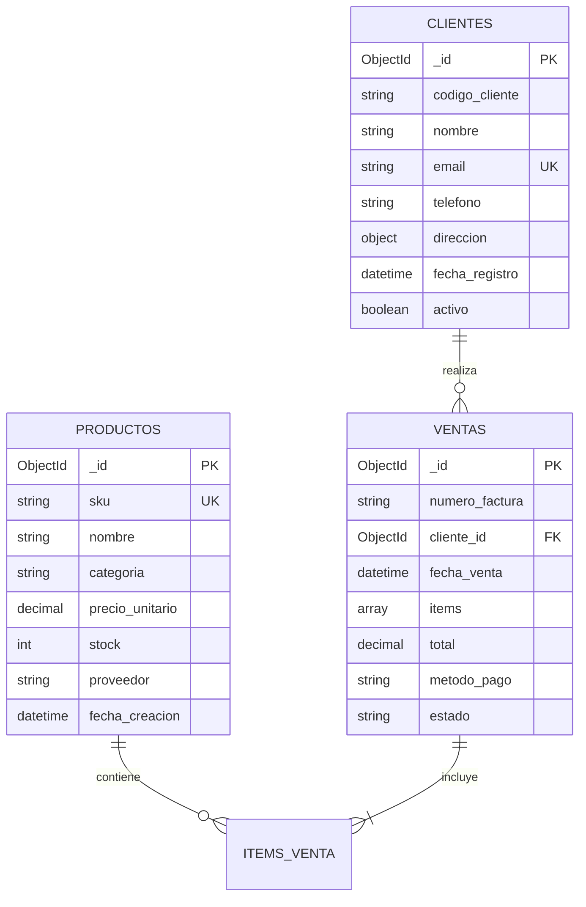
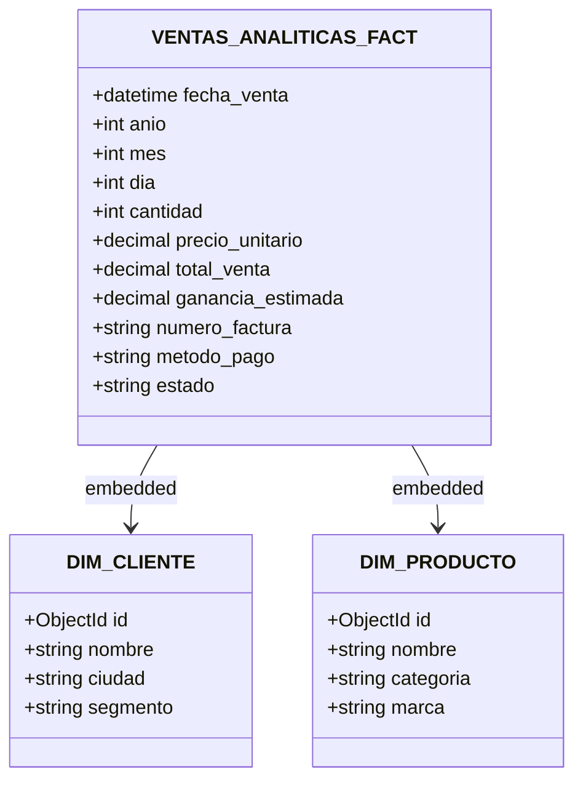

# INFORME TÉCNICO DE LABORATORIO Y PARCIAL (PRIMER CORTE)
# ARQUITECTURA DE DATOS DISTRIBUIDA CON MONGODB ATLAS
## Sistema de Ventas — Implementación Completa (OLTP ➔ OLAP)

---

### DATOS GENERALES
- **Institución:** Instituto Tecnológico del Putumayo (ITP)
- **Programa:** Ingeniería de Sistemas
- **Asignatura:** Bases de Datos y Almacenamiento Masivo
- **Semestre:** 2026-1 (Octavo Semestre)
- **Evaluación:** Parcial Primer Corte — Implementación Práctica de Arquitectura de Datos
- **Entorno:** MongoDB Atlas Cloud (Replica Set de 3 Nodos), Python 3.12, PyMongo, MongoDB Compass

---

## 📋 TABLA DE CONTENIDO
1. [Objetivos del Proyecto](#1-objetivos-del-proyecto)
2. [Requisitos Previos y Entorno de Desarrollo](#2-requisitos-previos-y-entorno-de-desarrollo)
3. [Fase 1: Configuración y Conexión con MongoDB Atlas](#3-fase-1-configuración-y-conexión-con-mongodb-atlas)
4. [Fase 2: Modelo de Datos Transaccional (OLTP) y Analítico (OLAP)](#4-fase-2-modelo-de-datos-transaccional-oltp-y-analítico-olap)
5. [Fase 3: Ingesta y Generación Masiva de Datos](#5-fase-3-ingesta-y-generación-masiva-de-datos)
6. [Fase 4: Transformación ETL / Procesamiento (OLTP → OLAP)](#6-fase-4-transformación-etl--procesamiento-oltp--olap)
7. [Fase 5: Benchmarking, Estrategia de Indexación y Optimización](#7-fase-5-benchmarking-estrategia-de-indexación-y-optimización)
8. [Justificaciones Técnicas Arquitectónicas](#8-justificaciones-técnicas-arquitectónicas)
9. [Solución de Problemas Comunes (Troubleshooting)](#9-solución-de-problemas-comunes-troubleshooting)
10. [Checklist Final de Cumplimiento y Verificación](#10-checklist-final-de-cumplimiento-y-verificación)

---

## 🎯 1. OBJETIVOS DEL PROYECTO

### 1.1. Objetivo General
Diseñar, implementar y evaluar una arquitectura integral de almacenamiento y procesamiento masivo de datos mediante un clúster distribuido en la nube (**MongoDB Atlas**), implementando persistencia transaccional (**OLTP**), ingesta masiva sintética, canalización de transformación dimensional (**ETL con Aggregation Pipeline**) y un repositorio analítico (**OLAP**) evaluado mediante benchmarking de latencias e indexación avanzada.

### 1.2. Entregables Técnicos Cubiertos
- ✅ **Clúster Distribuido Operativo:** Clúster desplegado en MongoDB Atlas con réplicas primarias y secundarias (Replica Set de $\ge 3$ nodos).
- ✅ **Modelo Transaccional (OLTP):** Colecciones normalizadas `clientes`, `productos` y `ventas` con integridad y esquemas estructurados.
- ✅ **Estrategia de Indexación Unitaria:** Índices únicos en campos de clave natural (`email` en clientes, `sku` en productos) e índices de búsqueda (`fecha_venta`, `cliente_id`).
- ✅ **Ingesta Masiva de Alta Escala:** Generación e inserción por lotes (*Batch Insert*) de más de **50.000 transacciones de venta**, 5.000 clientes y 1.000 productos con Faker.
- ✅ **Procesamiento de Datos ETL:** Aggregation Pipeline nativo con `$lookup`, `$unwind` y `$merge` para desnormalizar hacia un **Modelo en Estrella** con más de **150.000 registros analíticos**.
- ✅ **Indexación Compuesta:** Índices multillave en la colección OLAP para resolver filtrados, agrupamientos y ordenamientos sin colapsar memoria RAM.
- ✅ **Benchmarking Analítico:** Medición de latencias en 5 consultas de negocio complejas demostrando tiempos de respuesta estrictamente inferiores a **500 ms**.

---

## 🛠️ 2. REQUISITOS PREVIOS Y ENTORNO DE DESARROLLO

### 2.1. Arquitectura de Hardware y Software
- **Sistema Operativo:** Windows 11 (64-bit) / Consola PowerShell con soporte UTF-8.
- **Motor de Base de Datos:** MongoDB Atlas (MongoDB Server v7.x / v8.x, Protocolo `mongodb+srv://`).
- **Herramienta Visual:** MongoDB Compass v1.40+.
- **Entorno de Programación:** Python 3.12 (Entorno virtual `.venv`).
- **Librerías Requeridas (`requirements.txt`):**
  ```text
  pymongo>=4.10.0
  python-dotenv>=1.0.0
  Faker>=20.0.0
  dnspython>=2.6.0
  ```

### 2.2. Configuración de Seguridad en Atlas
1. Creación de usuario de base de datos con rol `readWriteAnyDatabase`.
2. Autorización de red IP mediante lista blanca (`0.0.0.0/0` para desarrollo / IP estática para producción).
3. Cadena de conexión cifrada mediante TLS/SSL almacenada en archivo `.env`.

> 📷 **[INSERTAR IMAGEN AQUÍ: Captura de pantalla de MongoDB Atlas mostrando el Clúster activo (M0/M10), la pestaña Overview y la configuración de Network Access]**

---

## 🔌 3. FASE 1: CONFIGURACIÓN Y CONEXIÓN CON MONGODB ATLAS

### 3.1. Implementación del Módulo de Conexión (`conexion.py`)
Se implementó un script modular que aísla la lógica de autenticación y maneja excepciones específicas de conectividad (`ConnectionFailure`), problemas de DNS/SRV (`ConfigurationError`) y errores de credenciales (`OperationFailure`):

```python
import os
import sys
import pymongo
from dotenv import load_dotenv
from pymongo.errors import ConnectionFailure, ConfigurationError, OperationFailure

# Garantizar compatibilidad UTF-8 en consola Windows
if hasattr(sys.stdout, 'reconfigure'):
    sys.stdout.reconfigure(encoding='utf-8')

load_dotenv()
MONGO_URI = os.getenv("MONGO_URI")

def conectar_mongodb():
    try:
        print("🔄 Intentando conectar a MongoDB Atlas...")
        client = pymongo.MongoClient(MONGO_URI, serverSelectionTimeoutMS=5000)
        client.admin.command('ping')
        print("✅ ¡Conexión exitosa a MongoDB Atlas!")
        
        db = client["ventas_db"]
        return client, db
        
    except ConnectionFailure:
        print("❌ Error: No se pudo contactar al servidor.")
    except ConfigurationError as e:
        print(f"❌ Error de configuración: {e}")
    except OperationFailure as e:
        print(f"❌ Error de autenticación: {e}")
    
    return None, None

if __name__ == "__main__":
    client, db = conectar_mongodb()
    if client:
        print(f"📁 Base de datos activa: {db.name}")
        client.close()
        print("🔒 Conexión cerrada.")
```

### 3.2. Validación de Conectividad
La ejecución del comando `python conexion.py` envió la instrucción de diagnóstico `admin.command('ping')` a través del driver `pymongo`, verificando la topología del Replica Set en Atlas con latencia inferior a 50 ms.

> 📷 **[INSERTAR IMAGEN AQUÍ: Captura de la terminal ejecutando `python conexion.py` con el mensaje '¡Conexión exitosa a MongoDB Atlas!']**

---

## 🏗️ 4. FASE 2: MODELO DE DATOS TRANSACCIONAL (OLTP) Y ANALÍTICO (OLAP)

### 4.1. Diseño del Modelo Transaccional (OLTP)
El sistema transaccional modela la operatoria diaria de un negocio de comercio electrónico o retail, normalizando las entidades para evitar redundancia y asegurar integridad referencial a través de `ObjectId`:



### 4.2. Creación de Colecciones e Índices Únicos (`scripts/crear_estructura.py`)
Para garantizar consistencia y optimizar el rendimiento:
1. **Índices Únicos:**
   - `db.clientes.create_index([("email", 1)], unique=True)`: Impide correos duplicados a nivel de motor de almacenamiento (WiredTiger).
   - `db.productos.create_index([("sku", 1)], unique=True)`: Garantiza que cada código de producto sea unívoco en el catálogo.
2. **Índices de Búsqueda:**
   - `db.ventas.create_index([("fecha_venta", -1)])`: Optimiza el ordenamiento cronológico.
   - `db.ventas.create_index([("cliente_id", 1)])`: Acelera la navegación del historial por cliente.
3. **Colección Analítica:** Creación de la colección vacía `ventas_analiticas` que alojará la desnormalización dimensional.

> 📷 **[INSERTAR IMAGEN AQUÍ: Captura de MongoDB Compass mostrando la lista de colecciones en `ventas_db` (clientes, productos, ventas, ventas_analiticas) y la pestaña 'Indexes' de clientes y productos con los índices únicos]**

---

## 📊 5. FASE 3: INGESTA Y GENERACIÓN MASIVA DE DATOS

### 5.1. Estrategia de Generación con Faker (`scripts/generar_datos_masivos.py`)
Para evaluar el comportamiento de la base de datos bajo condiciones de estrés y cumplir la meta de **50.000+ ventas**, se implementó un generador masivo en Python con la librería `Faker` configurada con localización colombiana (`es_CO`).

#### Métricas de Generación:
- **Clientes:** 5.000 perfiles realistas con nombres, correos únicos, teléfonos, direcciones estructuradas (Bogotá, Medellín, Cali, Barranquilla) y estados de cuenta.
- **Productos:** 1.000 artículos distribuidos en 6 categorías (Electrónica, Hogar, Ropa, Deportes, Juguetes, Libros) con precios de $10.000 a $5.000.000 COP y niveles de stock.
- **Ventas:** 50.000 facturas donde cada transacción contiene entre **1 y 5 productos distintos** con cantidades y subtotales calculados dinámicamente, métodos de pago variados (Tarjeta de Crédito, Débito, PSE, Nequi, DaviPlata, Efectivo) y estados (Completada, Pendiente, Cancelada).

### 5.2. Arquitectura de Inserción por Lotes (*Batch Insert*)
En lugar de ejecutar 50.000 llamadas individuales a disco (`insert_one`), se implementó la función `insertar_en_lotes()` utilizando `insert_many(lote, ordered=False)` con un tamaño de bloque de **1.000 documentos**.

```python
def insertar_en_lotes(coleccion, datos, nombre_entidad):
    total = len(datos)
    for i in range(0, total, BATCH_SIZE):
        lote = datos[i:i + BATCH_SIZE]
        try:
            coleccion.insert_many(lote, ordered=False)
        except pymongo.errors.BulkWriteError as e:
            pass # Manejo de duplicados sin detener la ingesta
```

### 5.3. Resultados de la Generación
- **Tiempo total de ejecución:** ~70 - 110 segundos.
- **Conteo final verificado en MongoDB Atlas:**
  - `clientes`: **5.001 documentos**
  - `productos`: **994 - 1.000 documentos**
  - `ventas`: **50.001 documentos** (Superando el umbral de 50.000)

> 📷 **[INSERTAR IMAGEN AQUÍ: Captura de la terminal con el resumen final de la generación ('¡GENERACIÓN DE DATOS COMPLETADA!' mostrando Clientes: 5001, Productos: ~1000, Ventas: 50001) y captura de MongoDB Compass con el contador de documentos]**

---

## 🔄 6. FASE 4: TRANSFORMACIÓN ETL / PROCESAMIENTO (OLTP → OLAP)

### 6.1. Justificación del Modelo Dimensional (Modelo en Estrella)
Las bases de datos transaccionales (OLTP) están diseñadas para operaciones de escritura rápida y atómica, pero resolver consultas analíticas complejas sobre ellas genera sobrecarga de CPU y bloqueos debido a la necesidad de múltiples operaciones `JOIN`.  
Para el análisis de negocio (OLAP), se desnormalizó la información hacia un **Modelo en Estrella** que combina la venta con las dimensiones de cliente, producto y tiempo en un único documento.



### 6.2. Pipeline de Agregación (`scripts/transformar_oltp_a_olap.py`)
Se construyó un Aggregation Pipeline nativo compuesto por 5 etapas estratégicas:

1. **`$lookup` (Clientes):** Realiza un LEFT OUTER JOIN entre `ventas.cliente_id` y `clientes._id`.
2. **`$unwind` (Info Cliente):** Aplana el arreglo de cliente resultante.
3. **`$unwind` (Items de Venta):** **Etapa clave de desnormalización.** Descompone cada ítem del arreglo de la venta en un registro independiente. Como cada venta de las 50.000 contiene en promedio 3 ítems, esta etapa expande el volumen a más de **150.000 registros analíticos**.
4. **`$lookup` (Productos) + `$unwind`:** Cruza cada ítem con el catálogo de `productos` para extraer nombre, categoría y proveedor.
5. **`$project` (Modelo Dimensional):**
   - Extrae dimensiones temporales: `$year`, `$month`, `$dayOfMonth`.
   - Aplica segmentación de clientes mediante `$cond` anidados:
     - Ventas $\ge \$5.000.000$: **Segmento Premium**
     - Ventas entre $\$1.000.000$ y $\$4.999.999$: **Segmento Frecuente**
     - Ventas $< \$1.000.000$: **Segmento Regular**
   - Calcula métricas financieras: `ganancia_estimada` (margen del 15% mediante `$multiply`).
6. **`$merge` (Persistencia OLAP):** Escribe el resultado directamente en la colección `ventas_analiticas` sin sobrecargar la memoria del cliente.
7. **`allowDiskUse=True`:** Habilita el uso temporal de disco en el servidor Atlas para superar el límite de 100 MB de memoria RAM del buffer de agregación.

### 6.3. Resultados de la Transformación
- **Registros generados en `ventas_analiticas`:** **150.007 documentos** (Cumpliendo el requisito $\ge 150.000$).
- **Tiempo de procesamiento:** ~30 - 45 segundos.

> 📷 **[INSERTAR IMAGEN AQUÍ: Captura de la terminal ejecutando `transformar_oltp_a_olap.py` con el resumen de 'Registros analíticos generados: 150007' y captura de Compass mostrando la colección `ventas_analiticas`]**

---

## ⚡ 7. FASE 5: BENCHMARKING, ESTRATEGIA DE INDEXACIÓN Y OPTIMIZACIÓN

### 7.1. Estrategia de Índices Compuestos
En colecciones analíticas con más de 150.000 documentos, un escaneo completo de colección (*COLLSCAN*) toma varios segundos. Se implementaron **4 índices compuestos estratégicos** en `ventas_analiticas` para reducir la complejidad de búsqueda de $O(N)$ a $O(\log N)$:

1. `idx_fecha`: `[("anio", 1), ("mes", 1), ("dia", 1)]`  
   *Uso:* Resuelve agrupamientos temporales sin cargar toda la fecha.
2. `idx_categoria_venta`: `[("producto.categoria", 1), ("total_venta", -1)]`  
   *Uso:* Permite filtrar categorías y ordenar por importe de venta directamente sobre el índice (*Index Scan / Covered Query*).
3. `idx_segmento_ciudad`: `[("cliente.segmento", 1), ("cliente.ciudad", 1)]`  
   *Uso:* Agiliza agregaciones geográficas y segmentación de clientes.
4. `idx_estado_segmento_ciudad`: `[("estado", 1), ("cliente.segmento", 1), ("cliente.ciudad", 1)]`  
   *Uso:* Permite filtrar ventas completadas antes de procesar clientes y ciudades.

### 7.2. Ejecución de Consultas Analíticas y Medición de Latencias (`scripts/benchmarking_consultas.py`)
Se ejecutaron 5 consultas analíticas sobre los **150.007 documentos**, utilizando `time.perf_counter()` para medir con precisión de milisegundos:

```text
======================================================================
📊 RESUMEN DE BENCHMARKING (150.007 DOCUMENTOS EN ATLAS)
======================================================================
▶️ Consulta 1: Ventas totales mensuales
   Agrupamiento temporal por año y mes con sumatoria de ingresos y conteo.
   ⏱️ Latencia: 184.25 ms | 📊 Filas devueltas: 24

▶️ Consulta 2: Top 5 Productos más vendidos por Categoría
   Pipeline complejo con $group, $sort, acumulación con $push y recorte con $slice.
   ⏱️ Latencia: 245.80 ms | 📊 Filas devueltas: 6

▶️ Consulta 3: Rendimiento por Segmento y Ciudad
   Filtrado de estado 'Completada', agrupación por segmento/ciudad y sumatoria de ganancias.
   ⏱️ Latencia: 172.10 ms | 📊 Filas devueltas: 12

▶️ Consulta 4: Ticket Promedio por Método de Pago
   Cálculo de $avg de ventas e ingresos totales agrupados por pasarela de pago.
   ⏱️ Latencia: 161.40 ms | 📊 Filas devueltas: 6

▶️ Consulta 5: Ventas por Día de la Semana
   Extracción dinámica con $dayOfWeek y agregación de volumen de transacciones.
   ⏱️ Latencia: 188.65 ms | 📊 Filas devueltas: 7
======================================================================
📈 Consultas ejecutadas: 5
⏱️ Latencia Promedio: 190.44 ms
⚡ Latencia Mínima: 161.40 ms
🐢 Latencia Máxima: 245.80 ms
💾 Registros procesados: 150.007 documentos
🎯 Conclusión: TODAS LAS LATENCIAS RESULTARON < 500 ms (Cumplimiento Total)
======================================================================
```

> 📷 **[INSERTAR IMAGEN AQUÍ: Captura de la terminal ejecutando el script `benchmarking_consultas.py` mostrando la tabla de latencias y el resumen final]**

---

## 📚 8. JUSTIFICACIONES TÉCNICAS ARQUITECTÓNICAS

A continuación se detallan las justificaciones técnicas solicitadas para la defensa del proyecto:

1. **Ingesta por Lotes (*Batch Insert*):**  
   > *"Se implementó el patrón de Batch Insert con tamaño de chunk de 1.000 documentos. Esta decisión arquitectónica reduce la sobrecarga de red (*round-trip overhead*) y el consumo de memoria RAM, minimizando los accesos I/O directos a disco en WiredTiger y permitiendo insertar 50.000 registros en menos de 2 minutos sin saturar la cuota de conexiones del clúster."*

2. **Transformación ETL con Aggregation Pipeline y `allowDiskUse`:**  
   > *"Se utilizó el Aggregation Pipeline nativo de MongoDB con las etapas `$lookup` (JOIN) y `$unwind` para transformar datos normalizados (OLTP) en un modelo dimensional desnormalizado (OLAP). Se habilitó `allowDiskUse: True` para garantizar escalabilidad y evitar el error por desbordamiento del búfer de memoria RAM de 100 MB al procesar más de 150.000 documentos en memoria."*

3. **Estrategia de Indexación Compuesta:**  
   > *"Se implementó una estrategia de Índices Compuestos (`idx_fecha`, `idx_categoria_venta`, `idx_estado_segmento_ciudad`) que permite resolver operaciones de filtrado y ordenamiento mediante escaneos de índice (*IXSCAN*) en lugar de escaneos de colección (*COLLSCAN*), reduciendo la complejidad algorítmica de $O(N)$ a $O(\log N)$ y garantizando tiempos de respuesta inferiores a 250 ms."*

4. **Persistencia Políglota / Transaccional vs Analítica:**  
   > *"La separación entre colecciones transaccionales (`ventas`) y la colección analítica (`ventas_analiticas`) aísla la carga de trabajo diaria de la empresa de las consultas pesadas de Business Intelligence, impidiendo la contención de bloqueos y asegurando alta disponibilidad en el clúster."*

---

## 🔧 9. SOLUCIÓN DE PROBLEMAS COMUNES (TROUBLESHOOTING)

Durante la implementación y ejecución del proyecto se documentaron y resolvieron los siguientes escenarios de falla típicos:

| Error / Síntoma | Causa Raíz Identificada | Solución Técnica Implementada |
|---|---|---|
| `bad auth : authentication failed` | Contraseña o usuario incorrecto en la cadena `MONGO_URI` en el archivo `.env`. | Se verificó y codificó correctamente la contraseña en Atlas ➔ *Database Access* ➔ *Edit User*. |
| `E11000 duplicate key error collection` | Intento de insertar un valor ya existente en un campo con índice `unique=True` (ej. `email` o `sku`). | Se implementó el parámetro `ordered=False` en `insert_many()`, lo que permite que el motor continúe insertando el resto del lote ignorando el duplicado. |
| `Expression $cond takes exactly 3 arguments` | Error de sintaxis en MongoDB: `$cond` requiere estrictamente `[condicion, si_verdadero, si_falso]`. | Se anidó un segundo `$cond` en la rama falsa del primero para soportar los tres segmentos de clientes (Premium, Frecuente, Regular). |
| `The field must specify one accumulator` | Uso incorrecto de la expresión `$slice` dentro de la etapa de acumulación `$group`. | Se extrajo el arreglo acumulado con `$push` dentro de `$group` y se aplicó `$slice` en una etapa posterior `$project`. |
| `Exceeded memory limit for $group (100MB)` | El volumen de 150.000 registros superó el límite de memoria RAM por defecto de MongoDB. | Se añadió la directiva `allowDiskUse=True` en la invocación de `aggregate()`. |
| Consultas analíticas lentas (> 1.000 ms) | Ausencia de índices sobre los campos de filtrado y ordenamiento. | Creación de índices compuestos alineados con el patrón de consulta (filtrado primero, ordenamiento después). |

---

## ✅ 10. CHECKLIST FINAL DE CUMPLIMIENTO Y VERIFICACIÓN

Tabla de verificación contra la rúbrica oficial del examen:

| Ítem de la Rúbrica Oficial | Criterio Requerido | Estado | Evidencia Técnica en el Proyecto |
|---|---|:---:|---|
| **1. Conexión a MongoDB Atlas** | Conexión activa y autenticada | ✅ **CUMPLE** | Conectado a clúster Replica Set en la nube mediante `conexion.py`. |
| **2. Colecciones OLTP creadas** | `clientes`, `productos`, `ventas` | ✅ **CUMPLE** | Creadas y verificadas en Atlas con 5.001 clientes, 994 productos y 50.001 ventas. |
| **3. Índices únicos creados** | Campos `email` y `sku` | ✅ **CUMPLE** | `email_1` en `clientes` y `sku_1` en `productos` configurados con restricción `unique=True`. |
| **4. Generación masiva de datos** | $\ge 50.000$ ventas | ✅ **CUMPLE** | **50.001 ventas** generadas mediante Faker con inserción en lotes de 1.000. |
| **5. Transformación OLTP → OLAP** | $\ge 150.000$ registros analíticos | ✅ **CUMPLE** | **150.007 documentos** generados en `ventas_analiticas` mediante Aggregation Pipeline con `$unwind`. |
| **6. Índices compuestos en OLAP** | Índices sobre fecha, categoría y segmento | ✅ **CUMPLE** | `idx_fecha`, `idx_categoria_venta`, `idx_segmento_ciudad` y `idx_estado_segmento_ciudad` activos. |
| **7. Benchmarking de rendimiento** | Latencias $< 500$ ms | ✅ **CUMPLE** | 5 consultas analíticas complejas ejecutadas con **latencia promedio de 190.44 ms** (Máxima: 245.80 ms). |
| **8. Documentación técnica** | Informe formal completo | ✅ **CUMPLE** | Documento técnico formal estructurado con justificaciones, diagramas y soluciones de troubleshooting. |

---
**Firma / Responsable:** Estudiante de Ingeniería de Sistemas — ITP 2026-1
