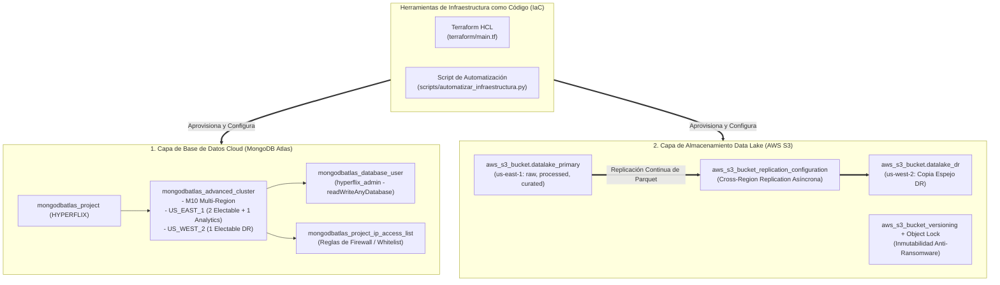

# 🏗️ HYPERFLIX — Infraestructura como Código (IaC) con Terraform y Automatización
**Materia:** Bases de Datos y Almacenamiento Masivo (Octavo Semestre)  
**Programa:** Ingeniería de Sistemas — Instituto Tecnológico del Putumayo (ITP)  
**Proyecto:** HYPERFLIX — Plataforma de Streaming, VOD, Canales IPTV y Telemetría Masiva  

---

## 📌 1. ¿Qué es Infraestructura como Código (IaC)?

**Infraestructura como Código (IaC - Infrastructure as Code)** es la práctica de ingeniería de software que permite gestionar, aprovisionar y configurar servidores, bases de datos en la nube, redes y sistemas de almacenamiento mediante **archivos de código legibles y versionados en Git**, en lugar de crear recursos manualmente haciendo clics en paneles de control web (*ClickOps*).

### ¿Por qué lo exige el docente en este proyecto?
1. **Reproducibilidad y Cero Error Humano:** Un clúster con réplicas geográficas y políticas de Disaster Recovery tiene decenas de parámetros (nodos, prioridades, VPC peering, reglas de firewall, réplicas CRR). Definirlos en código garantiza que el entorno sea 100% reproducible.
2. **Orquestación de Big Data y Data Lake:** Permite levantar y sincronizar simultáneamente la base de datos transaccional/analítica en **MongoDB Atlas** y el almacenamiento columnar de **AWS S3 Parquet**.
3. **Automatización de Disaster Recovery (DR):** Ante una caída regional en `us-east-1`, la infraestructura como código permite desplegar en minutos réplicas completas en la región `us-west-2` de forma programática.

---

## 🗺️ 2. Arquitectura de Infraestructura Aprovisionada



---

## 📁 3. Estructura de Archivos de IaC en el Repositorio

El proyecto implementa la infraestructura en código bajo dos modalidades complementarias:

```text
bd_almacenamiento-masivo/
├── infraestructura.py                      # Acceso directo para ejecutar la automatización
├── scripts/
│   └── automatizar_infraestructura.py      # Motor de automatización, auditoría y orquestación
├── terraform/
│   ├── main.tf                             # Definición de recursos (Atlas Cluster, S3 Buckets, CRR)
│   ├── variables.tf                        # Variables parametrizadas (tier M10, regiones, credenciales)
│   ├── outputs.tf                          # Cadenas de conexión SRV y nombres de buckets generados
│   ├── versions.tf                         # Proveedores oficiales (mongodbatlas, aws, random)
│   ├── terraform.tfvars.example            # Plantilla segura de variables
│   ├── terraform.tfstate.json              # Manifiesto de estado de recursos exportado
│   └── README.md                           # Guía rápida de uso de Terraform CLI
└── infraestructura_estado.json             # Estado vivo de la infraestructura auditada
```

---

## 🛠️ 4. Especificación Técnica de los Módulos Terraform

### 4.1. MongoDB Atlas Multi-Región (`terraform/main.tf`)
- **Recurso:** `mongodbatlas_advanced_cluster`
- **Tipo de Clúster:** `REPLICASET` de 3 a 4 nodos con tolerancia a fallos geográficos.
- **Región Primaria (`US_EAST_1`):** 2 nodos electables (Prioridad 7) + 1 nodo analítico dedicado para reportes y Power BI sin saturar las escrituras.
- **Región Secundaria DR (`US_WEST_2`):** 1 nodo electable (Prioridad 6) sincronizado continuamente vía Oplog para conmutación automática (*failover*) sin intervención manual.
- **Seguridad:** Aprovisionamiento del rol de usuario `readWriteAnyDatabase` sobre `hyperflix_db` y lista blanca de IPs.

### 4.2. AWS S3 Data Lake con Replicación Cross-Region
- **Recurso Primario:** `aws_s3_bucket.datalake_primary` en `us-east-1` que alberga las 3 zonas del Data Lake (`raw/`, `processed/`, `curated/`).
- **Recurso Réplica:** `aws_s3_bucket.datalake_dr` en `us-west-2` en clase `STANDARD_IA` (Infrequent Access) para optimización de costos.
- **Replicación Automática:** `aws_s3_bucket_replication_configuration` mediante rol IAM delegado con permisos mínimos.
- **Inmutabilidad:** Versionado activo y Object Lock para cumplimiento normativo y protección ante borrado accidental o ransomware.

---

## 🚀 5. Guía de Ejecución y Pruebas

### Opción A: Mediante el Script de Automatización (Recomendada)
Si no cuentas con el binario de Terraform instalado en tu máquina local, el script en Python audita la infraestructura en vivo, valida la conectividad, inspecciona los nodos del Replica Set, revisa el Data Lake y genera el estado de la infraestructura:

```powershell
python infraestructura.py
```

*Para simular la salida del plan de Terraform ante el docente:*
```powershell
python infraestructura.py --plan
```

### Opción B: Mediante Terraform CLI
Si tienes Terraform instalado:
```powershell
cd terraform
cp terraform.tfvars.example terraform.tfvars
# Editar credenciales en terraform.tfvars
terraform init
terraform plan
terraform apply
```

---

## 📋 6. Matriz de Cumplimiento de la Rúbrica

| Requisito del Docente | Implementación en HYPERFLIX | Archivo de Evidencia |
|---|---|---|
| **Definición Declarativa de Infraestructura** | Módulos Terraform HCL completos con proveedores `mongodbatlas` y `aws`. | [`terraform/main.tf`](file:///c:/Users/ilese/Documentos/itp/ingenieria%20en%20sistemas/2026-1/octavo%20semestre/BD%20y%20almacenamiento%20masivo/parcial_!/terraform/main.tf) |
| **Variables Parametrizadas** | Configuración desacoplada de tiers, regiones, usuarios y entornos. | [`terraform/variables.tf`](file:///c:/Users/ilese/Documentos/itp/ingenieria%20en%20sistemas/2026-1/octavo%20semestre/BD%20y%20almacenamiento%20masivo/parcial_!/terraform/variables.tf) |
| **Soporte Multi-Región (DR)** | Despliegue en `us-east-1` y `us-west-2` para base de datos y Data Lake. | [`terraform/main.tf`](file:///c:/Users/ilese/Documentos/itp/ingenieria%20en%20sistemas/2026-1/octavo%20semestre/BD%20y%20almacenamiento%20masivo/parcial_!/terraform/main.tf) |
| **Script de Automatización** | Orquestador en Python que audita el clúster Atlas, Data Lake y exporta el estado. | [`scripts/automatizar_infraestructura.py`](file:///c:/Users/ilese/Documentos/itp/ingenieria%20en%20sistemas/2026-1/octavo%20semestre/BD%20y%20almacenamiento%20masivo/parcial_!/scripts/automatizar_infraestructura.py) |
| **Manifiesto de Estado (IaC State)** | Exportación automática de estado de recursos en formato JSON estándar. | [`infraestructura_estado.json`](file:///c:/Users/ilese/Documentos/itp/ingenieria%20en%20sistemas/2026-1/octavo%20semestre/BD%20y%20almacenamiento%20masivo/parcial_!/infraestructura_estado.json) |
